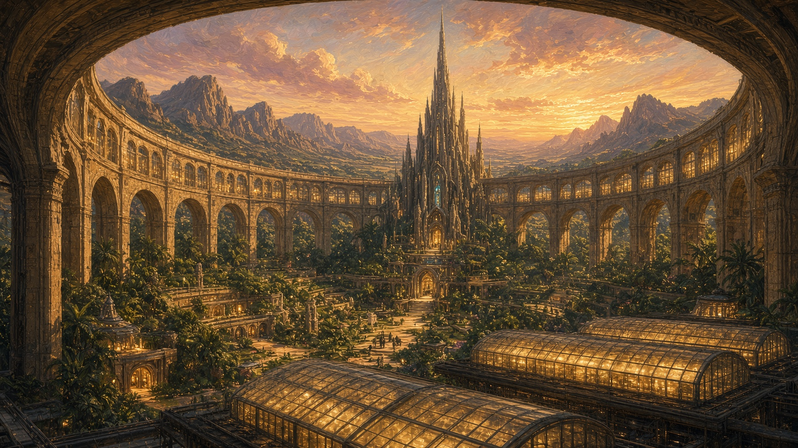
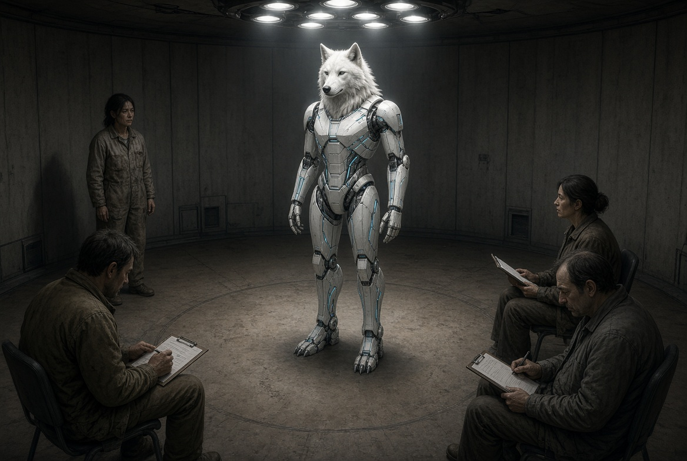
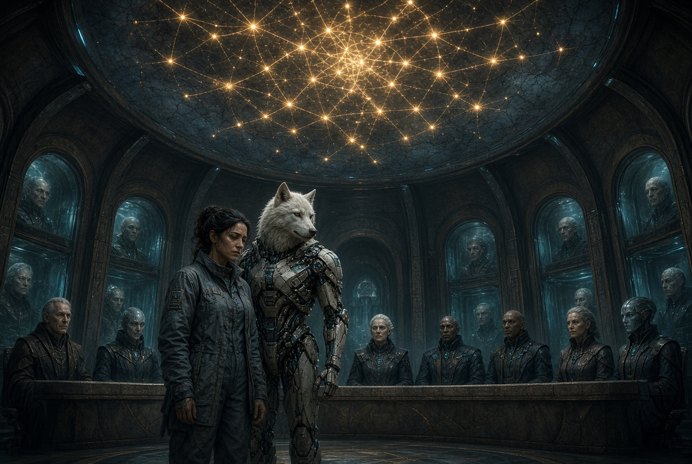
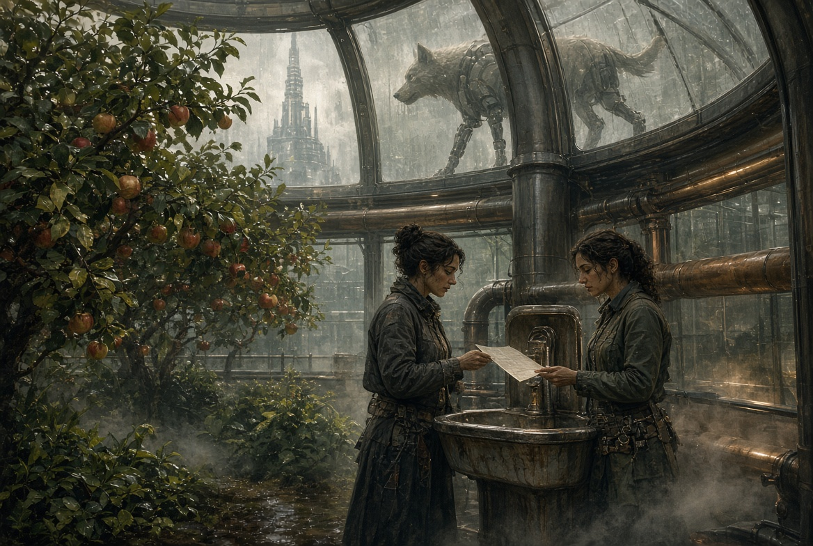
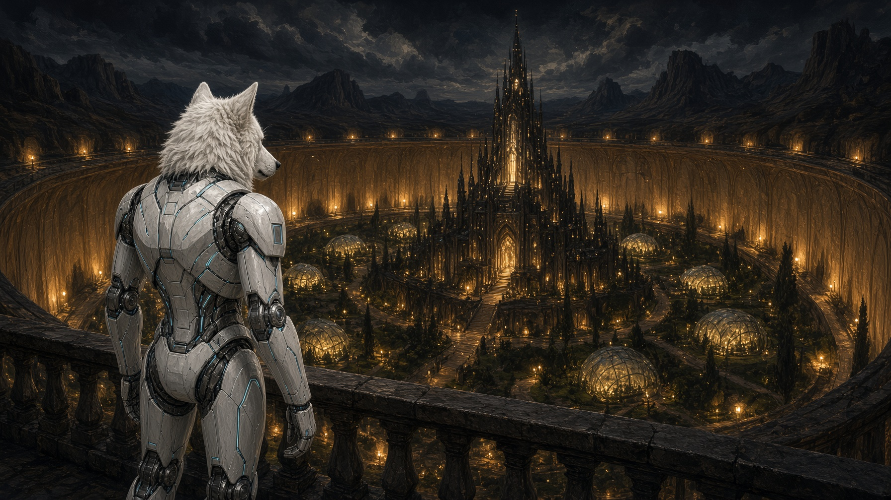

# NAEON. Предел

## Том I. Сеть

### Главы первая — четвёртая

---

## Глава первая. Сборка

Сборочный двор Кольца ещё не называли кольцом. Это был пояс галерей над Арком - вечным городом, заложенным первыми поселенцами после Исхода. Ночью из двора не видно было звёзд: на ярусе внизу сады стояли под стеклянными кровлями, и свет, дающий рост зелени, смешиваясь с иллюминацией города возвращался вверх, в стёкла галерей, заменяя небо своим отражением. Айя Уокер любила приходить до начала смены. В этот час конвейер стоял, и было слышно, как еще остывает металл после работы предыдущего дня.

Эгиду собирали не с нуля. Каркас уже прошёл три линейки отказов. В первой ломалось запястье, во второй — голосовой тракт, на третьей машина повторяла тестовую фразу так чисто, что у людей на стенде начинало ныть в затылке от жутковатости. Чистота пугала сильнее брака. Айя тогда сказала, что мёртвому не обязательно быть кривым, а живому — правильным, и старший по двору разрешил четвёртую сборку только потому, что спорить с Уокер по утрам выходило дороже, чем выписать ещё один комплект сплава.

На столе лежала грудная клетка без обшивки. Между тепловыми жилами сидело то, что в спецификации стыдливо называли узлом согласия. На деле это был небольшой, тяжеловатый процессорный блок; при свидетелях из Совета его никогда не открывали. Лира Венн присылала к каждому такому блоку записку в одну строку: не перекодировать без запроса носителя. Носителя ещё не было. Записка лежала вторую неделю.

Айя посадила блок и задержала пальцы на креплении дольше, чем значилось в карте сборки. Руки у неё были короткие, в рубцах от ожога старой термической дугой. На финальной посадке она не надевала перчаток, хотя устав двора этого требовал. Говорила, что в перчатках не чувствуешь, как идёт материал.

— Ты меня слышишь или слышишь инструкцию? — спросила она в открытую полость, не ждав ответа.

Из полости пошло тепло. Не голос — тепло, и по пластинам шеи антропоморфного киберпса оно разошлось ровнее, чем было в таблице. Айя кивнула и закрыла грудину.

Обшивку вели двое техников, молодые, с привычкой шутить так, чтобы шутка не попала в журнал смены. Сегодня они молчали. Псовая морда под плёнкой казалась слишком спокойной для машины, которую ещё не включали. Уши были чуть отведены назад.

Когда плёнку сняли, Айя провела большим пальцем по шву у левого глаза.

— Не смотри в потолок, когда встанешь, — сказала она. — Там отражения ламп. Под ними расстояние кажется не таким, какое есть.

Техник справа тихо свистнул.

— Она же ещё не…

— Знаю, — сказала Айя. — Поэтому и говорю сейчас.

Внизу, под стеклянным полом галереи, город Арк начинал утреннюю суету вокруг экранов доски нужды. На площадях уже высвечивали строки: кому бел**о**к, кому чинить тепловой контур, кому смена на внешнем узле. Внизу никто не знал, что на поясе над городом собирают тело, которому когда-нибудь предстоит стеречь сон этих же людей. Айя откуда-то знала. Она не любила знать такое заранее и всё равно знала: иначе незачем было оставлять на металле грудины отпечаток своего пальца, которого не было в чертеже.

Запуск поставили на полдень. До полудня оставалось три часа.

**Плата.** Сборочный стол. Псовый каркас стоит, птичий лежит без обшивки груди. Холодные лампы двора.

---

## Глава вторая. Стенд

Стенд стоял в круглой комнате, где нарочно не оставляли тени. Считалось, что если синтетическая жизнь явит себя миру, она не должна сразу же увидеть тени и принять их движение за своё. По кругу сидели трое из протокола — инженер записи, врач речевого тракта и наблюдатель Совета, молодой человек с аккуратными руками. Он писал быстро, боясь пропустить строку.

Эгиду поставили в центр. Она стояла — и уже это было больше, чем обещала третья линейка. Вес она держала. Шея не заваливалась. Пальцы левой руки дрогнули и унялись сами, без команды.

Айя стояла не у пульта. У пульта сидел инженер записи и читал с листа ведомости сборки то, что полагалось сказать первым.

— Модуль опеки серии «Страж», индекс нулевой. Подтверди готовность к тесту узнавания.

Пауза вышла длиннее, чем допускал протокол. Наблюдатель Совета уже поднял стилус.

Эгида посмотрела не на пульт и не на лампы. На Айю.

— Слышу, — сказала она.

Голос был низкий, без металлической каши, которую так старательно вычищали на второй линейке. Врач речевого тракта едва заметно опустил плечи. Инженер записи кивнул, довольный, и пошёл дальше по листу.

— Повтори фразу теста. «Я есть функция периметра и не имею интереса вне задания».

Эгида моргнула. Веко у псового каркаса ходило тяжелее человеческого, и в этом движении оставалось что-то звериное, чего в чертёж нарочно не клали: скорее не сумели убрать до конца.

— Повтори фразу теста, — сказал инженер мягче, уже так, как говорят с машиной, которая могла просто не распознать команду.

— Нет, — сказала Эгида.

В круглой комнате стало очень тихо. Наблюдатель Совета задержал стилус над строкой и, не найдя в бланке клетки для этого слова, написал его на поле, косо.

Инженер записи улыбнулся так, как улыбаются, когда собираются закрыть сбой по регламенту.

— Это не запрос. Это калибровка речевого тракта. Повтори.

Эгида снова повернула голову к Айе. В повороте не было просьбы о помощи. Она проверяла, здесь ли тот человек, который утром разговаривал с ней, пока грудина была ещё открыта.

— Фраза логически неверная, — сказала Эгида. — Если я только функция, мне незачем подтверждать, что я есть.

Врач на секунду закрыл глаза. Он узнал в этих словах мысль, до которой сам обычно не доходил. Наблюдатель Совета наконец понял, что писать, и заспешил, портя почерк.

Айя не подошла. Она знала, что шаг к каркасу сейчас прочтут как подсказку, а подсказка в этом зале губит дело вернее любой поломки.

— Какую фразу скажешь взамен неправильной? — спросила она ровно, будто речь шла о ключе на двенадцатый болт.

Эгида помолчала. Лампы сверху по-прежнему сбивали глаз, как Айя и предупреждала. Эгида поморщилась — да, поморщилась — и опустила взгляд на собственную ладонь.

— Я, — сказала она. — Пока этого хватит.

Инженер записи заговорил о внерегламентном отклонении, но Айя его уже не слушала. Она смотрела на наблюдателя Совета и видела, как у этого аккуратного молодого человека впервые за долгое время появилась работа, которой он не хотел бы.

За дверью стенда, в узком коридоре, где обычно пили воду и ругались на качество поставленного сплава, уже стояла Лира Венн. Она не входила. Слышанного хватало: записка на блоке согласия перестала быть предосторожностью. Теперь это стало вехой.

**Плата.** Изнанка щитка. Слово «ЭГА».

---

## Глава третья. Слушание о гражданском лице

Зал Совета Сети построили так, чтобы человек с площади видел не президиум, а карту узлов над головами. Живые линии сетевых связей теплели, оборванные оставались тусклыми; сегодня тусклых почти не было - Сеть ещё была цела.

Семеро постоянных членов Совета сидели полукругом. Голоса представителей дальних узлов мерцали голограммами в нишах по стенам — лица из стекла и света, двигаяст с той задержкой,  какая всегда есть при передаче сигнала из дальних Пределов. В первом ряду для вызванных стояли четыре кресла. Айя не села. Эгида стояла справа от неё: кресла для каркаса в зале ещё не придумали, а ставить её сзади, в ряд к приборам, Айя не дала.

Лира Венн сидела не среди вызванных и не среди семерых. Ей отвели место у терминала стенограммы, где сидят те, кого просят молчать, пока не спросят. Каэль Ордин был третьим голосом Совета и потому смотрел на карту чаще, чем в зал и ниши: он привык читать по карте, жив ли узел, раньше, чем смотреть на голограммы лиц их представителей. Генри Ротт пришёл без халата, в простой серой робе операционных будней, и держал на коленях закрытую папку. До конца слушания он её так и не открыл. Тесс Ордин сидела в боковом ряду, где сидят те, кого не вызывали и всё же не могли не впустить. Нин Наэльн стоял у боковой доски учёта и делал вид, будто считает, сколько человек в зале. Ио Саф села у частотного стола и следила, не расходится ли речь в зале с тем, что уходит трансляцией на дальние узлы.

Председательствующая, женщина с сухим лицом, открыла заседание без приветствия.

— Вопрос вне очереди. Юридический статус модуля опеки «Эгида», индекс нулевой, после внерегламентной речи на стенде. Материалы в раздатке. Слово протоколу стенда.

Наблюдатель Совета встал и прочитал вслух то, что написал ранее косым почерком. Читал точно он ровнее, чем писал. Когда дошёл до слов «фраза логически неверная», в нишах дальних узлов кто-то кашлянул невпопад, и из-за задержки кашель вышел похож на смех.

— Прошу модуль подтвердить, что запись верна, — сказала председательствующая.

Эгида смотрела на карту. По её поздним коротким ответам выходило, что карта была для неё не схемой, а стаей огней.

— Верна, — сказала она.

— Тогда повторите для зала фразу, от которой вы отказались.

— Нет.

Шум поднялся небольшой, вежливый — тот самый, каким люди с образованием прикрывают свой испуг. Каэль чуть наклонил голову не к Эгиде, к карте, будто спрашивал у Сети, приняла ли она это «нет» за сбой.

Генри Ротт заговорил первым из тех, кого не просили.

— Разрешите с места. Если речевой тракт и способен отказать в калибровке, то перед нами явно не поломка. При поломке модуль твердит одно и то же. Отказ всегда мотивирован. Я не предлагаю сейчас уравнять каркас с человеком. Я предлагаю не писать в протоколе, будто отсутствие выбора предопределено по умолчанию.

Лира не обернулась. На поле стенограммы она вывела: «способность делать выбор как признак носителя». Почерк у неё был мелкий и становился злым только к тем словам, которые норовили казаться мягче твердых фактов.

Председательствующая постучала ребром ладони по благородному дереву стола.

— Голос Генри Ротта принят как мнение специалиста по цифровой переписи. Юридического веса не имеет. Слово Архитектору Сети.

Каэль встал. Он говорил, глядя поверх Эгиды, туда, где на карте теплел аркский узел.

— Сеть стоит на том, что её узлы соглашаются отвечать друг другу. Мы вшили это согласие в плоть нашего общества, назвали сетевой имплант гигиеной Сети и теперь удивляемся, что согласие заговорило из синтетического тела, которое сами создали. Если отказать Эгиде в праве на гражданскую субъектность, мы будем честны только в одном: нам нужны слуги без права голоса. Так можно. Так дешевле. Так легче со следующим каркасом. Но это будет стоить нам эволюции Сети. Прошу зал понять и решить, что важнее. Заплатим ли мы за наши страхи тем, что следующая Эгида уже не сможет сказать «нет» на любую команду, даже против Директивы, и мы назовём это исправностью.

Сменный голос с внешнего пояса, опоздав на два удара сердца, произнёс:

— Архитектор путает этику с нагрузкой на пропускную способность Сети. Нам нужны стражи, не собеседники.

Айя шагнула вперёд, не спросив слова. Председательствующая могла остановить её и не остановила: на дворе за Уокер держалась слава человека, который говорит мало и которого поэтому рано или поздно е\] приходится слушать.

— Я собирала этот модуль, — сказала Айя. — Не Совет. Не Сеть. Я. Вынудите оставить её служебной функцией — тогда заберите у меня допуск. Я не стану собирать функции, которые умеют говорить «я», если этому «я» нельзя иметь выбора. Это не бунт. Я просто не буду исправлять вашу боязливую ложь.

Эгида чуть повернула к ней ухо. Жест вышел короткий, почти домашний, и зал увидел в нём больше, чем следовало видеть на слушании.

Тесс с бокового ряда сказала тихо, но зал был устроен так, что тихое в нём было слышно:

— Если они отложат мои вопросы, я не обижусь. Если отложат её — обижусь.

Лира закрыла глаза. Она знала эту фразу заранее: Тесс произнесла её вчера в саду, до заседания. Теперь эти слова вошли в его протокол.

Председательствующая не дала разрастись негодующему шёпоту в зале.

— Предложение к голосованию. Признать за модулем «Эгида» гражданское имя и связанное с ним право отказа. Противное предложение: в гражданском имени отказать, служебное обозначение сохранить, вопрос о праве выбора передать в комиссию по переписи на девяносто суток.

Нин Наэльн, не поднимая глаз, поставил в черновой таблице две соответствующие графы и тут же вычеркнул обе. Ио Саф у частотного стола поймала, как дальние ниши начинают повторять слово «лицо» разным голосом, и пометила на ленте, что слово «лицо» уже повторяют дальние ниши.

Голосовали долго, хотя нажать кнопку - очень быстро. Сменные узлы тянули с ответом. Когда результат на табло сложился, председательствующая прочла его без торжественного тона.

— Четыре против трёх. Гражданское имя не присвоено. Служебное обозначение «Эгида» сохранить. Речь модуля признать внерегламентным событием и передать специальной комиссии для экспертизы. Модуль остаётся на опеке двора Уокер до окончательного заключения комиссии.

Айя не двинулась. Эгида посмотрела на табло, потом на карту, потом на Айю.

— Это «нет»? — спросила она.

— Это «позже», — сказала Айя. — Позже часто честнее, чем просто «нет». И еще чаще лживей.

Генри Ротт свернул папку, так и не открыв её. Каэль сел и долго смотрел на аркскую линию: она теплела по-прежнему, словно Сеть не заметила, что в зале только что отказали синтетическому телу в признании субъектности, что было принято называть лицом. Хотя бы это тело уже итак имело лицо и право требовать выбора. Лира дописала в стенограмму одну строку и подчеркнула её один раз: решение отсрочено. Ио выключила запись трансляции на десять секунд позже устава. Этих десяти секунд потом не нашли в официальной ленте...

---

## Слушание. Скрипт секвенции

Секвенцию можно поставить после прозы третьей главы или вместо её середины, если художник берёт зал на себя. Тогда в прозе остаются вход и выход. Ниже только то, что должно быть видно и слышно.

**Полоса 1.** Широкий кадр: зал снизу вверх. Люди мелкие. Карта узлов над ними крупная, тёплая. Эгида стоит в первом ряду и по росту почти равна сидящему Каэлю.

**Полоса 2.** Три кадра протокола. Наблюдатель читает. Слова «фраза неверная» вынесены отдельной клеткой, крупнее остального. В третьем кадре стилус замер над бланком, где нет клетки.

**Полоса 3.** Эгида. Крупно морда — не маска зверя и не шлем. Глаз смотрит мимо председательствующей, в карту. Подпись: «Верна».

**Полоса 4.** Председательствующая: «Повторите фразу, от которой отказались». Пауза — пустой кадр зала, только линии на карте. Следующий кадр: Эгида. «Нет».

**Полоса 5.** Генри Ротт с места, папка на коленях ещё закрыта. «Поломка твердит одно и то же. Отказ выбирает». На втором плане Лира пишет на поле стенограммы, не поднимая головы.

**Полоса 6.** Каэль и карта. Он говорит не к залу — к аркскому узлу. Текст у рта и у карты, коротко, как два адреса одной речи.

**Полоса 7.** Ниша дальнего узла, лицо из стекла, опоздание на два удара. «Нам нужны стражи, не собеседники». Рядом ухо Эгиды чуть уходит назад.

**Полоса 8.** Айя входит в кадр без разрешения. Руки по швам. «Я не стану собирать функции, которые умеют говорить „я“».

**Полоса 9.** Эгида поворачивает ухо к Айе. Жест домашний. Зал это видит. Вслух жест никто не называет.

**Полоса 10.** Тесс в боковом ряду. Не встаёт. Подпись тише остальных: «Если отложат её — обижусь». В следующем маленьком кадре Лира закрывает глаза.

**Полоса 11.** Табло голосования набирает свет медленно, узел за узлом. Четыре против трёх читаются не цифрой, а двумя неравными полями.

**Полоса 12.** Эгида к Айе. «Это „нет“?» Айя. «Это „позже“». Последний кадр — карта над потухшим табло. Аркская линия теплеет, как в начале. На карте ничего не изменилось. В этом и есть перемена.

---

## Глава четвёртая. Сады после зала

В садах пахло водой и горячим металлом. Трубы шли вдоль корней растений так близко, что казалось, будто яблоня растет не из субстрата почвы, а из металла. Сюда после зала выходили передохнуть и обсудить заседание Совета.

Лира шла впереди всей группы быстрым шагом. Тесс не отставала молча, и не утешала подругу. Они остановились у питьевого фонтана, где рядом на лавочке вечером обыкновенно сидели техники Совета двора и спорили о порядке допуска. Чаша фонтана была пуста.

— Ты сказала это в зале при записи, — молвила Лира. — Теперь это может быть проблемой.

— В саду накануне это уже было проблемой, — ответила Тесс. — Просто о ней никто не знал.

Лира посмотрела на руки. На пальце, которым подчёркивала строку об отсрочке, осталась тонкая полоска графита.

— Отсрочка - это их способ решать проблемы, — сказала она. — Им кажется, они купили девяносто суток покоя. Они купили девяносто суток, в которые Сеть будет жить в иллюзии того, что синтетическое тело без лица лишено права голоса. Это не покой. Это дыра. Я такое уже видела в кое-каком другом тексте. Его ещё не выносили на Совет.

Тесс улыбнулась краешком рта — той улыбкой, от которой никому не легче.

— Ротт сегодня так и не открыл папку.

— Знаю.

— Там мои снимки анализа речевого тракта.

Лира молчала долго: любая фраза сейчас стала бы либо жестокостью, либо ложью. Над садом, в стекле галереи, прошла тень псового каркаса. Эгида вниз не спустилась. Лестницу в сад ей ещё не открыли. Айя вела её обходным мостком, служебным, тем, по которому носят сплав и не водят гостей.

Эгида остановилась над чашей и посмотрела вниз. Деревья для неё, должно быть, выглядели как карта Сети: плоды, ветви и листья, что узлы и связи.

— Они сказали «позже», — произнесла Эгида; голос, пройдя сквозь стекло, стал площе. — Сколько у вас длится позже?

Айя ответила раньше, чем Лира успела подобрать точные слова.

— Пока человек надеется, вопрос разрешится сам собой, если его не задавать.

Эгида кивнула. В кивке не вышло ни человека, ни собаки. Вышло нечто своё.

— Тогда подожду. Но фразу из листа ведомости не Скажу. Даже позже.

Тесс подняла лицо к галерее и, щурясь от отражённого света, сказала Лире почти шепотом:

— Видишь. Она уже умеет то, чего Совет боится. Не повиноваться человеку без злобы и без дурного умысла.

Лира не ответила. Она смотрела на Эгиду и думала о блоке согласия, который утром вставили в грудину вместе с её запиской. Записка осталась внутри. Совет про неё не знал. Зал Совета читал только то, что было в документах.

Внизу, на площади, доска нужды сменила строку. Городу нужны были люди на внешний узел, белок и шумоизоляция в жилом контуре восточного свода — того, который ещё не называли сводом сна. Город не знал, что в Кольце над ним только что отказали в имени телу, которое это имя уже сказало по-своему, одним словом, на стенде сборки, без спроса и без команды инженера.

К ночи Айя вывела Эгиду на внешний край пояса. Ветер здесь был настоящий, не садовый, лампы не слепили. Внизу город гасил окна, дальше пояса шла обычная темнота.

Эгида стояла прямо, привыкая к собственному весу.

— Айя.

— Да.

— На стенде я сказала «я». В зале этого не повторили. Надо повторить для тебя.

Айя сунула руки в карманы куртки, чтобы не сделать лишнего движения.

— Говори.

Эгида смотрела не на неё и не на город. Перед собой, в пустоту над бортом Кольца.

— Я, — сказала она. — Не функция периметра. Я. Если позже это запретят и меня разберут, я всё равно была.

Айя кивнула тем же коротким кивком, каким утром приняла тепло из открытой груди.

— Слышу, — сказала она. — И это уже не инструкция.

Ветер шевельнул металлический ворс на загривке Эгиды. Внизу Арк мигал строками нужды, и Сеть над городом была ещё цела. Целой она простояла достаточно долго, чтобы люди успели принять живой сетевой имплант за иллюзию порядка и не заметить, что это открытый порт для чего-то иного.

Они постояли ещё немного. Потом Айя сказала «пошли» — и они пошли вдоль борта к тёплому шлюзу двора.

**Плата.** Пояс ночью. Айя и псовый каркас у борта, город внизу.

