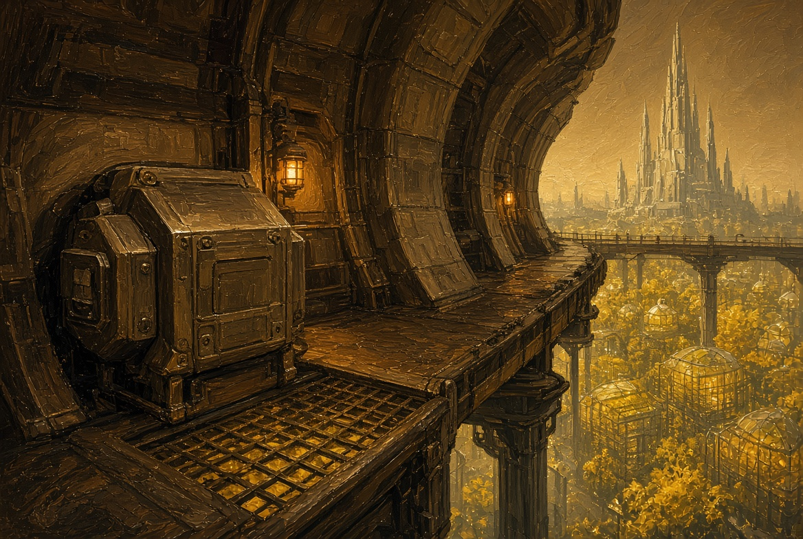
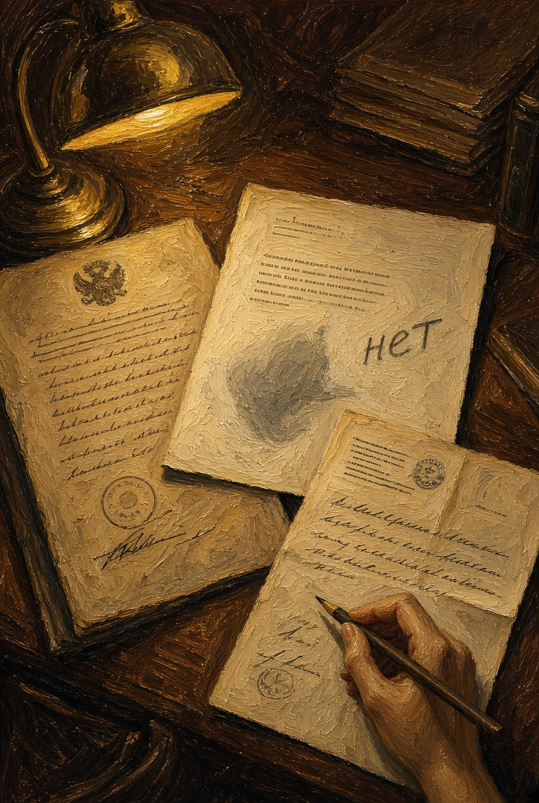
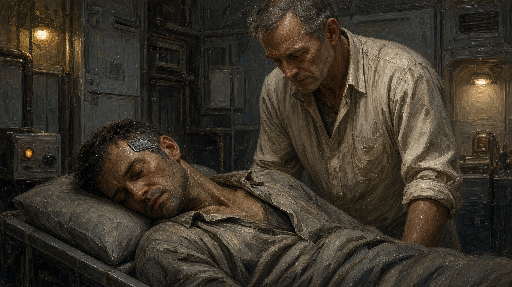
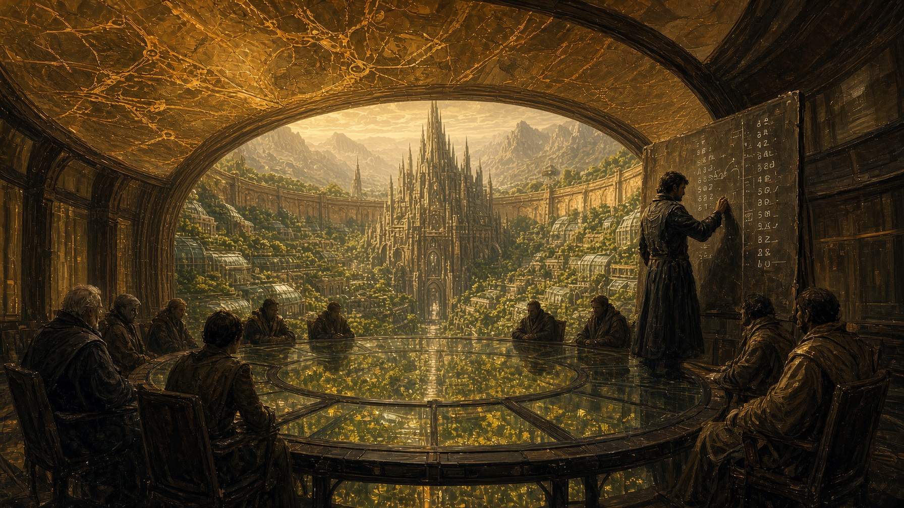

# NAEON. Предел

## Том I. Сеть

### Главы пятая — восьмая

---

## Глава пятая. Узел

Каэль Ордин не любил назначать запуск на утро после большого заседания Совета: люди приходили сонные, проговорив полночи о случившемся, с чужими фразами в голове, и на проверках путали порядок действий. И всё-таки сегодняшний запуск он назначил сам. Лучше уж путать порядок, чем сидеть над стенограммой и снова перечитывать, как четыре голоса против трёх отказали каркасу в имени.

Новый узел стоял на внешнем ребре пояса, в кессоне без окон, где пахло озоном и холодным маслом. За тонкой стенкой гудел тот самый тепловой контур, о котором на дворе шутили осторожно: одни считали его отоплением галерей, другие — тем, что когда-нибудь оторвёт пояс от опор. Каэль таких шуток не любил. Контур грел металл, а всё остальное было чужой работой.

Младший инженер, девушка с обгорелым запястьем, держала планшет обеими руками, хотя хватило бы и одной.

— Рукопожатие с Арком прошло, — сказала она, — и с поясом тоже. Три дальние точки пока молчат, но срок ответа ещё не истёк.

— Не торопи их, — сказал Каэль. — Дальним всегда нужно на два удара больше, на то они и дальние. Сбоем тут не пахнет.

Он провёл ладонью по кожуху — металл был чуть теплее воздуха. На старой карте такой узел рисовали точкой, а на живой карте зала он станет линией, если, конечно, ответ придёт.

— Вы ведь вчера голосовали, — сказала девушка и тут же пожалела. — Простите, это не моё дело.

— Голосовал, — сказал Каэль. — За имя. Не прошло, а работать всё равно надо.

Он услышал, как эта фраза закрывает то, что вчера так и не закрылось, и поправлять её не стал. Девушка кивнула и уставилась в планшет. На запястье у неё, под следом ожога, темнело крошечное гнездо связи — ещё старого образца, не того, о котором скоро будут спорить в зале, — и когда она волновалась, пальцы сами искали это место.

Через сорок секунд дальняя точка ответила: сначала служебным пакетом, а следом второй строкой, уже человеческой, с внешнего рудника:

«Слышим. Смену не бросаем. Нужен фильтр на третьем насосе».

Каэль выдохнул через нос. Нин поставит фильтр на доску нужды, кто-то получит наряд, и насос не встанет — так город жил уже много лет. Ничего чудесного тут не было, просто работа, и бросать её из-за одного заседания было бы стыдно.

— Отмечай узел живым, — сказал он. — А фильтр отправь Нину напрямую, не через меня.

Когда они вышли из кессона, за ограждением лежала долина, а не чужое небо. Пояс галерей шёл по верху аркады, и сквозь решётку мостка, под стеклом, Арк зажигал площади у себя внутри: сады, низкие ярусы, доски нужды. Посередине, как всегда, стоял шпиль Цитадели. Дальше серой полосой уходил внешний склон, а ещё дальше блестел челнок: он покидал земные ворота и тянул к руднику низко, по воздуху долины.

С этой галереи кольцо читалось без карты. Арк и был этим кольцом из тёплого медового камня, с арками как у старого акведука и со стеклянными оранжереями по внутренней стене. Внутри лежали сады, площади и жильё, а по верху шли дворы, кессоны и мостки, которые на смене всё ещё звали поясом. В центре поднималась Цитадель, высокий собор со множеством шпилей, где держали знание и живые линии Сети. За внешней дугой начиналась долина между гор, лесистые склоны и зубчатые хребты, и на склонах уже шла работа рудников. Дальние посёлки отвечали оттуда с задержкой на два удара сердца, потому что ответ шёл по жиле. Аркада стояла на земле долины. О том, что пояс когда-нибудь снимут с опор, если земля перестанет быть домом, на смене шутили только в сторону теплового контура.

Каэль поискал глазами двор Уокер, но с этой галереи его было не разглядеть — слишком мелкий. Он подумал о каркасе, который вчера стоял в зале и спрашивал, «нет» это или «позже», и отложил эту мысль. Узел ответил, и на сегодня этого хватало.

У закрытых панелей киля, где контур шумел ровнее, чем в кессоне, стоял кто-то в капюшоне и техкуртке — ростом ниже инженеров, с короткими лапами и тонкой насечкой на рукаве. Каэль кивнул ему как своему: ремонтники кромки голоса Совета не спрашивали. Тот кивнул в ответ, но не назвался. Ключ у него в пальцах был маленький и тяжёлый.

По кромке Каэль шёл пешком. Здесь пояс был дорогой по верху аркады: тёплые панели киля, редкие лампы и ветер с долины, который по утрам пах мокрой зеленью, а к полудню пылью рудника. Наряд на фильтр уходил пакетом, смена подтверждала приём короткой строкой, и с доски нужды брали работу, не торгуя белком и водой. Предание об Исходе мелькало в имени города и в звериных головах каркасов, а работать всё равно надо было сегодня.

Чай в буфете пояса, как всегда, был жидкий. Нин Наэльн сидел у стены с двумя таблицами и одной булкой; он, ни о чём не спрашивая, подвинул Каэлю стакан и продолжал медленно жевать, как человек, который считает не ради спора.

— Фильтр я уже видел, поставлю, — сказал Нин. — А про вчерашнее в таблицу ничего не вносил: некуда, графы нет.

— И не надо, — сказал Каэль.

Нин пожевал, подумал и всё-таки сказал:

— Когда графы нет, потом кажется, будто и дела не было. А дело было: имя каркасу не дали. Только нолём его не запишешь, его просто вписать некуда.

Каэль не спорил. Он смотрел, как за стеклом буфета идёт смена — люди с допусками, двое в пыльных комбинезонах с рудника, женщина с папкой Совета, — и пил чай, хотя тот уже остывал. Ни город, ни Сеть не остановились; только у него в голове всё ещё стояли зал и табло, которое зажглось четырьмя против трёх.

**Плата.** Кессон на ребре пояса. Кожух узла. Внизу сквозь решётку — сады и шпиль Цитадели, не пустота.

---

## Глава шестая. Поля

Архив этики помещался не в садах, а внизу, в старом корпусе, где зимой едва теплились батареи и пахло бумагой, хотя бумагу здесь почти не держали. Лира Венн любила это место за тишину, о которой не приходилось просить. На карту над головой тут никто не смотрел — здесь смотрели на поля.

До архива Лира спускалась через нижнюю галерею садов, уже внутри кольца. За стеклом шла утренняя поливка: жёлтый ряд, вода на листьях, женщины со шлангами. На площади у третьего спуска горела доска нужды, деревянная рама с латунью и янтарными табличками. Первой строкой шёл набор на внешний фильтр, второй — двое на поливку, третьей, ещё карандашом, очередь клиники третьего пояса. Кто мог, брал строку, а кто не мог, оставлял её соседу. Воду, белок и смену здесь ставили в расписание, и зал в это утро ещё не называл такую работу большим словом.

На столе лежал протокол переписи эмбриона под длинным номером, с пометкой «добровольно, оба родителя, клиника третьего пояса». Процедура значилась частичная: правка иммунного ответа и одно гнездо памяти, «чтобы ребёнок не выпадал из Сети в первые годы», — так там и было написано. Лира читала медленно, с карандашом над полями, хотя карандаш давно считался дурным тоном, и графит оставлял на пальце ту же тонкую полоску, что и после стенограммы в зале.

На третьей странице она остановилась.

В тексте стояло: «При отсутствии ответа носителя решение принимает клиника в интересах будущей совместимости». Носителя ещё не было, и ответа быть не могло, а фраза получилась гладкая и походила на заботу.

Лира написала на поле одно слово: «нет». А ниже, мельче: «интересы совместимости не заменяют запроса. Запроса нет и не будет. Процедуру остановить либо переписать пункт».

Старшая по архиву, женщина лет шестидесяти с коротким седым ёжиком, заглянула ей через плечо. Она знала Лиру давно и всё равно всякий раз удивлялась, как мало та повышает голос, когда злится.

— Опять ты за эмбрионов.

— Не за эмбрионов, — сказала Лира, — а за пункт, который делает вид, будто спрашивает того, кого ещё нет.

— Родители согласились.

— Родители согласились за него, а это другое дело. Мы это уже проходили с блоками согласия на дворе Уокер, но там хотя бы есть кому потом сказать «нет». А здесь некому.

Старшая вздохнула и присела на край стола. Руки у неё были в мелких бумажных порезах — обычное дело в архиве, который притворяется, что бумаги в нём нет.

— Совет вчера отложил каркас, а ты хочешь, чтобы сегодня они остановили клинику?

— Я хочу, чтобы в протоколе не было лжи. Если клиника решает сама, пусть так и напишут, а не прикрываются носителем.

Она отдала лист на регистрацию с отказом, и машина в углу чиркнула номером. На этом рабочий день мог бы и кончиться, но Лира не ушла: достала копию вчерашней стенограммы и положила её рядом с протоколом эмбриона. В одном тексте откладывали лицо тому, кто уже сказал «я», в другом собирались править того, кто ещё ничего не сказал, и оба называли себя заботой.

Клиника третьего пояса стояла в жилом корпусе внутри кольца, где спирт перебивал запах земли. Туда приходили поправить иммунный ответ, вернуть дорожку памяти или посадить гнездо у виска, чтобы человек не выпадал из расписания после срыва на смене. В постановлении это ещё не звали гигиеной, хотя в зале слово уже пробовали на слух. Полную перепись тела в протоколах обходили: старое правило не велело искать средство от смерти, и клиника держала этот запрет хотя бы на бумаге. Лира поставила «нет» не на правку вообще, а на фразу, которая делает вид, будто спрашивает того, кого ещё нет.

Вечером она зашла к Тесс — не в сад, а в жилой отсек на среднем ярусе, где у Ординых стояли узкий стол и две чашки, всегда одни и те же. Ротт ещё не пришёл. Тесс сидела, поджав ноги, и читала медицинский лист без картинок — медленно, как читает человек, который уже знает, что там про него написано, и всё равно проверяет.

— Ты написала «нет», — сказала Тесс, не поднимая глаз. — Я уже слышала, в клинике ругаются.

— Пусть ругаются.

— Ротт тоже будет ругаться. Он считает, что за каждой остановкой — чей-то будущий распад.

— Я знаю, что он считает.

Тесс отложила лист и улыбнулась той же улыбкой, что и в саду после зала, — той, от которой никому не легче.

— Я не прошу тебя останавливать его руки. Я прошу только не делать вид, будто вы с ним спорите о технике. Вы спорите о том, кто вправе решать, когда самого человека спросить нельзя. У эмбриона спросить некого, а у меня — иногда тоже.

Лира помолчала, а потом сказала только:

— Пункт я не уберу.

Тесс кивнула — так кивают, когда ждали именно этого, — и всё-таки поставила на стол третью чашку, для Ротта. Чай в ней остыл раньше, чем он пришёл.

**Плата.** Три листа архива: постановление, поле с карандашным «нет», ответ клиники.

---

## Глава седьмая. Шахтёр

Операционная Генри Ротта была меньше, чем думают те, кто туда не входит: ровный свет, узкий стол, на стене две полки с лотками — и никакой торжественности. На столе лежал мужчина лет сорока, с ещё пыльной шеей; его привезли с внешнего рудника прямо со смены, на челноке, который садится у земных ворот пояса. Узел памяти оборвался у него возле насоса — того самого, на который утром просили фильтр.

Внешний рудник сидел на склоне той же долины, за зубчатым хребтом, куда челнок тянул низко, по воздуху, минуты двенадцать, если ветер не бил в борт. Там пахло мокрой пылью и машинным маслом, и люди работали звеном: насос, фильтр, скамейка, на которой ждут, пока выровняется давление. Без ответа из Арка туда не приходили ни смена, ни запасной фильтр, поэтому место и считали узлом Сети, рабочей точкой связи. Гнездо у виска шахтёру ставили давно, ещё по старому образцу: узкая пластина, чтобы расписание смены не терялось под шум насоса. Дорожка вела от слуха к складу смен, и когда она рвалась, человек помнил имя урывками и путал год со сменой.

— Он ещё в сознании? — спросил Ротт, уже в перчатках.

— С перерывами, — сказала ассистентка. — Имя своё называет, а смену путает.

Ротт наклонился над ним. Руки у него были спокойные, и этим спокойствием он дорожил больше, чем репутацией в зале: в зале можно отложить, а здесь нельзя.

— Меня слышишь?

Мужчина открыл один глаз.

— Слышу. Насос…

— Насосом займутся другие, а сейчас твоя память. Лежи.

Вскрывать гнездо у виска Ротт умел быстро. В эту минуту он думал не о Совете и не о каркасе, а о дорожке, которая ведёт от слуха к складу смен, — дорожка была оборвана. Заранее согласованный пакет переписи лежал в лотке: частичный, «в интересах возвращения к работе».

Ассистентка подала пакет.

— Там есть поле согласия, он подписал его на поясе, ещё до потери.

Ротт кивнул, вскрыл пакет и вшил. На всё ушло двадцать минут, и когда дорожка сомкнулась, мужчина дёрнул пальцами и сказал:

— Фильтр… на третий. Я же писал.

— Писал, — сказал Ротт. — Получат твой фильтр.

Мужчина улыбнулся криво, по-шахтёрски, и вдруг добавил, уже тише:

— Мы узел не бросаем. Не я. Мы.

Ротт посмотрел на монитор: ритм ровный, речь чистая. Это «мы» могло быть просто привычкой смены — так говорят люди, которые давно работают звеном, — а могло быть и чем-то другим. Ротт вытер пальцы и «другое» записывать не стал: писать было некуда. «Графы нет», — сказал бы Нин.

По дороге домой Ротт прошёл мимо земных ворот. Челнок с рудника уже стоял на захватах, люк был открыт, и экипаж пил воду из бака у рельса. Причал шёл над садами внутри кольца, шпиль Цитадели стоял в центре, и люди на рельсе спорили, хватит ли фильтра до ночной смены: челнок сел, человек жив, насос ещё не встал.

После смены он застал Тесс дома. Лира уже ушла, а на столе стояла третья чашка, так и не выпитая. Ротт сел, снял браслет допуска и положил его на стол — тяжёлый, самый обычный браслет, который он всегда снимал дома. Тесс это замечала и никогда ничего не говорила.

— Живой, — сказал Ротт. — Подержу его в лазарете, пока речь не устоится, а там вернётся на рудник.

— Хорошо.

— Лира опять ставит «нет» на полях.

— Знаю. Она мне сказала, что не уберёт.

Он потёр переносицу в том месте, где когда-то оставляли след очки, хотя очков давно уже не носил.

— Если останавливать каждую частичную правку, люди будут падать у насосов и больше не вставать. Ты же это понимаешь.

— Понимаю. Я говорю не про каждую, а про те, где спросить некого, и про те, где спрашивают, а потом всё равно делают.

Он долго смотрел на неё, потом кивнул — не в знак согласия, а в знак того, что услышал. Папка со снимками её речевого тракта стояла у стены, за шкафом, и он снова её не открыл. Тесс знала, что не откроет, и всё равно следила за его руками, пока он не убрал их со стола.

Ночью, когда Тесс уже спала, Ротт сидел на краю койки и слушал дом: вентиляцию, шаги за переборкой и далёкий гул галереи на опорах аркады. Никакого «мы» в этих звуках не было. Он сказал себе, что шахтёр просто привык так говорить на смене, и лёг. Засыпалось плохо.

**Плата.** Лазарет. Койка, пластина у виска, пыль ещё на шее.

---

## Глава восьмая. Гигиена

Внеочередное заседание назначили через шесть дней после слушания о лице. Повод был сухой: на внешнем руднике участились отказы узлов памяти — три случая за месяц, и один из них тот самый шахтёр. Комиссия связи просила разрешить массовую посадку живых имплантов «как гигиену Сети», потому что без этого, писали они, дальние точки начнут отваливаться пакетами.

Зал был тот же, и карта над головами так же теплела. Эгиды на этот раз не было: без вызова Айя не привела её второй раз. Лира села у стенограммы и сразу взяла карандаш, Каэль смотрел на карту чаще, чем на лица, а Ротт пришёл с открытой папкой — только снимки в ней были чужие, не Тессины. Ио заняла частотный стол и первым делом проверила, совпадает ли то, что звучит в зале, с тем, что уходит на дальние точки. Нин стоял у доски и вывел на ней две цифры: сколько узлов ещё работает на старых гнёздах и сколько выпадет за год, если ничего не менять. Писал он их мельче обычного, как человек, которому стыдно за собственную ясность.

На карте над головами Цитадель стояла точкой в центре, а Арк — медовым кольцом на земле: сады и жильё внутри аркады, пояс галерей по её верху. Дальние ниши, рудник, внешний склон и посёлки за хребтом, входили с задержкой на два удара. Председательствующая читала устав и считала свет на табло.

— Треть, — сказал Нин, когда его спросили. — Не сразу, за поколение. Это если считать честно, без паники.

Председательствующая кивнула.

— Проект постановления. Живой имплант признаётся средством гигиены связи. Посадка — по согласию совершеннолетнего носителя. Для недееспособных и для эмбрионов — отдельный регламент, который этика представит в девяносто суток. Кто хочет с места?

Каэль встал первым и говорил, глядя на рудную линию, которая в то утро ответила ему в кессоне.

— Без живых гнёзд дальние смены будут жить с оборванной связью, я видел это на запуске. Мы уже вшили Сеть в работу, и теперь надо либо честно её снабжать, либо так же честно отрезать пояс. Отрезать я не готов.

Ротт говорил с места, не вставая.

— Частичная посадка спасает память, я сам делал её на этой неделе, и человек вернулся. Если вы боитесь слова «гигиена», придумайте другое — суть ведь не в слове.

Лира подняла руку, но слово ей дали не сразу.

— Я не против гнёзд, — сказала она. — Я против пункта, которого здесь ещё нет, но который появится, стоит вам принять общее слово «гигиена». Лечение спрашивает, а гигиена — нет. Запишите прямо: посадка только по запросу носителя. А для тех, кто запросить не может, — отдельный запрет, а не «отдельный регламент потом». Чем кончается это «потом», вы уже знаете.

Сменный голос с рудника отозвался с задержкой на два удара:

— Нам гнёзда нужны сейчас, а регламент для эмбрионов подождёт. У нас люди падают у насосов.

Голосовали, и на этот раз свет сложился иначе: шесть против одного. Лира, у которой голоса не было, осталась у стенограммы одна со своим возражением. Каэль смотрел в карту, а не на неё. Ротт закрыл папку так осторожно, будто в ней лежало что-то живое. Нин вписал результат в ту самую графу, которой в прошлый раз не было: «гигиена — да». Рука у него не дрожала, дрогнул только взгляд, когда он перечитывал написанное.

Председательствующая сказала:

— Принято. Венн готовит оговорку к протоколу, срок — двадцать четыре часа. Комиссия по каркасу «Эгида» идёт отдельно, сроков не сдвигаем.

После зала Лира не сразу свернула в боковую комнату. Она остановилась у высокого окна на внутренность Арка: жёлтые кровли оранжерей, ряды садов, площади и в центре Цитадель со множеством шпилей, где стояли серверы и архивы. Живые линии на карте зала питались оттуда же, откуда питались гнёзда у висков. Пока кольцо было цело, одно общее слово садилось сразу на всех, кого эти линии доставали.

В боковой комнате, где обычно правят опечатки, она писала оговорку. Текст получился короткий: «Посадка живого импланта не производится без запроса носителя. Отсутствие запроса не восполняется интересами совместимости, интересами смены и интересами Сети». Она подписала его, посмотрела на последнюю строку и поняла, что оставила зазор в другом месте: слово «запрос» ничего не говорило о том, как быть с тем, кто однажды запросил, а потом передумал. Зазор был виден сразу, но закрыть его за сутки она не успевала и поставила на поле звёздочку. А звёздочки в протоколах живут долго.

Ио так и не ушла с частотного стола. Дальние ниши отвечали как обычно — пакетами и короткими фразами смен. На третьем часу, когда в зале уже мыли пол, с внешнего рудника пришёл ответ на запрос, которого Ио не посылала: в журнале этот запрос значился служебным вызовом без речи. А ответ был человеческий, только с чужим порядком слов:

«Слышим мы. Фильтр третьего не бросаем. Смену не я.»

Ио прокрутила ленту назад: служебный вызов уходил без речи, а значит, и в ответе речи быть не должно было. Она сняла копию на отдельную катушку, подписала время и в зал её не понесла. Зал только что решил, что живое гнездо есть гигиена, и нести туда чужой порядок слов значило либо поднять панику, либо услышать, что шахтёр просто устал.

Просидев ещё четверть часа, она убрала катушку в личный ящик, который запирался простым ключом, а не сетевым. Это тоже было решение, только за него никто не голосовал. Она вспомнила слушание о лице: трансляцию она выключила на десять секунд позже устава, и этих секунд, где дальние ниши ещё повторяли слово «лицо», в официальной ленте не оказалось. Зал и тогда оставил себе то, что умел подшить. Ио потёрла висок, где под кожей сидело её собственное гнездо, и впервые за день подумала, что слышит слишком хорошо.

Ночью Айя у себя на дворе читала Эгиде вслух выписку из постановления. Двор стоял на том же поясе, над садами внутри кольца, и внизу мигала доска нужды. Эгида слушала, наклонив голову; ухо у неё чуть ушло назад — тот самый домашний жест, который в зале увидели слишком рано.

— Гигиена, — повторила она. — Это про меня?

— Нет, это про людей, — сказала Айя. — Про тебя другая комиссия, у неё девяносто суток.

— Значит, позже.

— Да, позже.

Эгида помолчала.

— Шахтёр сказал «мы». Ты этого не слышала, а мне сказали на дворе: люди повторяют.

Айя выключила выписку и не стала спрашивать, кто сказал: на дворе новости ходят быстрее нарядов.

— Отдыхай. Завтра обшиваем птичью линейку, а потом учение у ворот. Будешь смотреть и не мешать. Скажу «работай» — работай, не скажу — стой.

— Буду смотреть, — сказала Эгида. — Но если на учении прозвучит логически неверная фраза, я её опять не повторю.

Айя чуть улыбнулась, одними губами.

— Тогда скажи это мне, а не листу. Пошли.

Эгида ушла в стойло, которое пока не решались называть комнатой, а Айя осталась у стола с выпиской. В постановлении всё было гладко. На поле, которого в выписке не было, Лира уже ставила звёздочку, но этого Айя ещё не знала. Знала она другое: двор снова начнёт собирать тела, Сеть — сажать гнёзда, а завтра у ворот пояса каркасу придётся двигать живых людей. Вещи это были разные, но их уже тянуло назвать одним словом.

**Плата.** Зал и карта над головами. Цифры на доске Нина. Внизу, не в небе — шпиль Цитадели.

