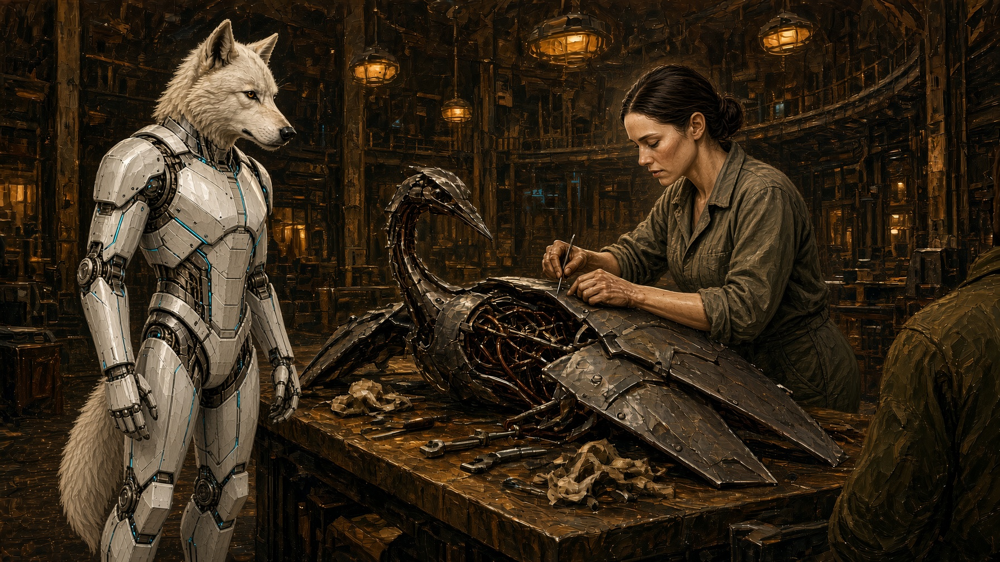
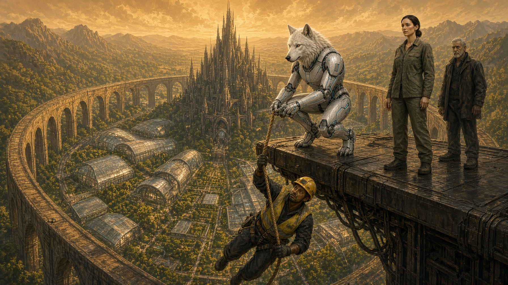
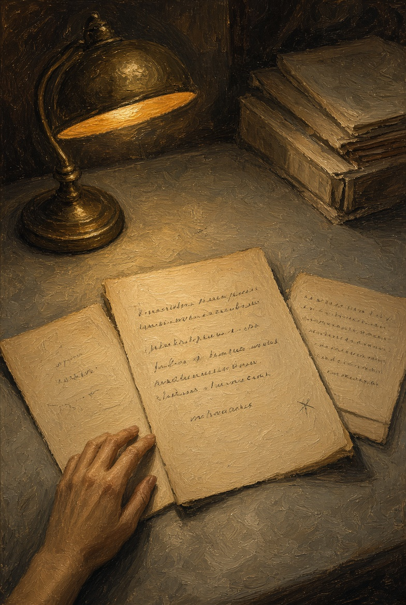
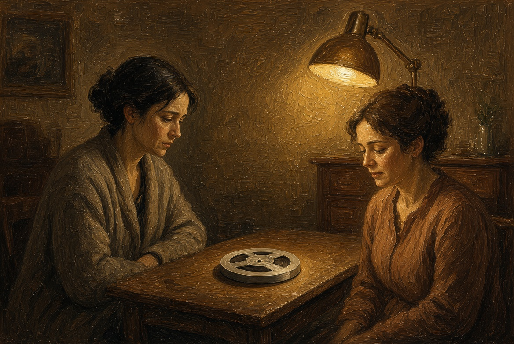
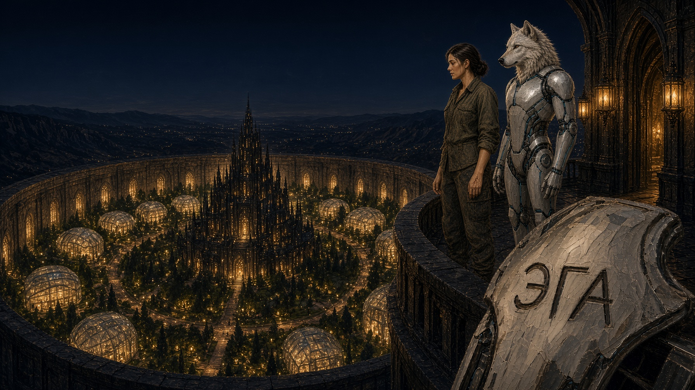

# NAEON. Предел

## Том I. Сеть

### Главы девятая — двенадцатая

---

## Глава девятая. Птичья линейка

На дворе пахло нагретым сплавом и мокрой ветошью. Птичью линейку вели на том же столе, где собирали Эгиду: каркас пролежал там без обшивки груди с того утра и только теперь дождался своей очереди. Ложементы под него поставили другие, потому что у птицы шея длиннее, а грудь уже, и за спиной у неё складывались щитки, которые в чертеже назывались «плащ-крыло», хотя в воздух их двор не поднимал. Летать с пояса было некуда: под ногами лежали сады и город внутри кольца, над головой кровля галереи, так что щитки просто берегли тепло и закрывали кабель.

Айя стояла у изголовья, а Эгида — сбоку, там, где обычно ставят ученика, которому велено не трогать инструмент. Она смотрела и изредка подавала ключ, если Айя кивала на лоток. Уши у неё были чуть отведены назад: она слушала весь двор, а не только стол.

Техник, который свистнул на сборке Эгиды, сегодня не свистел и работал молча. Только раз он сказал:

— Эта хотя бы фразу с листа повторит.

Ни Айя, ни Эгида ему не ответили. Через минуту Эгида спросила:

— Ей тоже будут говорить «позже»?

— Сначала пусть встанет, — сказала Айя, — а комиссия потом. Девяносто суток у нас на тебя, а не на всех сразу.

Птичий каркас включили без заседания и без торжества. Глаза у него загорелись ровным светом, голова послушно повернулась к лампе, и голосовой тракт выдал тестовую строку целиком, без запинки. Инженер записи, которого прислали ради одной этой строки, поставил в бланке «норма» и ушёл пить воду.

Эгида наклонила голову к готовой птице.

— Она сказала то, что ей велено. А я не сказала.

— Знаю, — сказала Айя. — Только не повторяй этого при комиссии, а то запишут как порчу линейки.

К середине дня щитки на спине птицы сложились ровно, и каркас увезли в стойло рядом с Эгидиным. Айя вытерла стол; на металле остался серый круг от ложемента.

— Теперь на ворота, там учение, — сказала она. — Смотри, а скажу «работай» — работай.

Ворота пояса стояли на внешнем ребре, там, где галерея выходит к челнокам. На космодромы из преданий о Колыбели они походили мало: причал над садами, два направляющих рельса, тросы и жёлтая черта, за которой ветер был уже настоящий. Далеко внизу мигала доска нужды. Челнок с рудника висел на захватах и слегка бился бортом о резиновый отбойник: раз в месяц двор устраивал такую учебную неисправность, чтобы Стражи не учились на живых авариях.

Инструктор опеки, сухой мужчина с седым пробором, прочитал с листа то, что полагалось читать Стражу.

— Модуль «Эгида». Задача: удержать человека на тросе, закрыть захват, не повредить корпус. Фраза подтверждения: «Я есть функция периметра и не имею интереса вне задания».

Эгида посмотрела на Айю, но та не кивнула и не покачала головой: любой её знак сейчас прочли бы как подсказку.

— Фразу я не повторю, она логически неверная, — сказала Эгида. — А задачу поняла.

Инструктор занёс стилус, но останавливать ничего не стал. Отказ от калибровки в деле модуля уже значился, отказа от работы там не было, и по пометке «служебный модуль» учение полагалось вести дальше.

Сирена на воротах взвыла коротко, по-учебному. Захват на челноке щёлкнул и разжал один палец, и человек в жёлтом жилете качнулся на тросе над провалом в три человеческих роста. Манекена на этот раз не было: на тросе висел живой техник двора со страховкой, а под ним блестел стеклянный навес сада, и упасть на стекло с такой высоты значило разбиться.

Эгида пошла короче и ниже, чем значилось в листе: вцепилась лапами в рельс, перехватила трос у бедра техника и приняла его вес на себя, чтобы не дёрнуло страховку. Техник выругался сквозь зубы и ухватился ей за плечо. Инструктор крикнул «закрыть захват», Эгида закрыла, и челнок перестал биться.

Потом инструктор крикнул ещё одно, уже от себя, по привычке старой школы:

— Дожать. Человек не должен качаться.

Эгида дожимать не стала: пальцы остановились там, где кость техника ещё не хрустнула. Она посмотрела на Айю.

— Он живой. Дожать значит сломать, а задача была удержать.

Тишина на воротах вышла короче, чем на стенде, и злее. Инструктор, не улыбнувшись, записал в бланк: «отклонение усилия, цель сохранена». Айя выдохнула только тогда, когда техника сняли с троса и он сам встал на рельс, растирая бедро.

— В следующий раз я скажу «работай» раньше, — тихо сказала ей Айя. — Но ты не обязана ждать моего слова, если человек уже летит. И ломать не обязана, даже если этого хочет лист.

Эгида потрогала собственную ладонь, ту, которой держала трос.

— Я, — сказала она. — Пока этого хватит и здесь.

С внешнего маяка, от закрытых панелей киля, на учение смотрел тот же капюшон, который в утро запуска кивнул Каэлю. В ворота Медоед не вошёл: он увидел, как каркас не дожал, и пошёл дальше по кромке, к узлу, который чинил в одиночку. За его спиной челнок выровняли, и сад внизу не получил ни осколка.

**Плата.** Сборочный стол: псовое тело стоит, птичье лежит. Потом ворота пояса: трос, жёлтый жилет, город под стеклом.

---

## Глава десятая. Звёздочка

Оговорку Лиры разослали утром как приложение к постановлению о гигиене. К полудню её цитировали уже в трёх местах, и ни в одном — так, как она писала.

На этот раз клиника третьего пояса ни о чём не просила: она прислала отказ на её же «нет» по эмбриону. Ссылались при этом на оговорку, на слова «по запросу носителя»: раз нет носителя, нет и запроса, а значит, пункт об остановке не действует, действует общее постановление, и эмбрион идёт в очередь на частичную правку. Лира прочла это стоя, у регистратора архива, потом села и написала ответ в шесть строк — без ругани, только указав, что отсутствие носителя дорогу не открывает, а закрывает. Ответ ушёл, но в тот день клиника промолчала.

Комиссия по Эгиде подошла к той же оговорке с другого края. В предварительной записке значилось: «модуль не является носителем в смысле приложения Венн; запрос с его стороны юридически ничтожен; служебное обозначение достаточно». Копию записки Лире передали к вечеру, и читала она её уже у Тесс дома, на том же узком столе; Ротт был на смене.

— Они моим текстом закрывают ей возможность сказать «нет», — сказала Лира. — Я писала про запрос живого, а они сделали из этого запрет на её речь.

Тесс подвинула ей чашку и на лист даже не взглянула: она смотрела на руки Лиры, где на пальце опять сидел графит.

— Ты же говорила про звёздочку: про того, кто запросил и передумал.

— Звёздочку не разослали, разослали гладкое. Гладкое всем удобно.

Утром Лира поймала Каэля у кессона, где он принимал уже второй узел за неделю. Слушал он, не снимая перчаток: после вчерашнего запуска он мало спал и оттого говорил ещё короче.

— Заново заседание я не открою, — сказал он. — По гигиене шесть голосов против одного, по каркасу четыре против трёх. Если я начну переголосовывать каждое приложение, Сеть станет собранием, а не связью.

— Я не про переголосование, а про клинику. Они делают правку тому, кого нет.

Каэль посмотрел на кожух узла, потом на неё. Внизу за ограждением зеленел сад; он это видел, но всё равно думал линиями.

— Напиши второе приложение, я поставлю его в очередь. Очередь не быстрая, но без решения зала больше я ничего не могу.

Лира кивнула: этого было мало, но большего она и не ждала. К вечеру в архиве лежало второе приложение с пометкой «ожидает окна», а окно в календаре Совета стояло через три недели.

**Плата.** Три листа на сером столе архива. На оговорке — звёздочка карандашом.

---

## Глава одиннадцатая. Катушка

Ио Саф пришла в архив, не записавшись на приём, и Лира её впустила. В комнате без окон Ио поставила на стол маленький ящик с ключом и достала катушку. Руки у неё были аккуратные, как у человека, который всю жизнь боится спутать чужое слово со своим.

— Здесь не заседание, — сказала она. — Понесёшь запись на заседание — скажу, что ошиблась в журнале.

— Сначала я послушаю.

Слушали тихо, без наушников, с узловой колонки. Сначала шёл сухой служебный вызов, а за ним человеческий ответ с чужим порядком слов: «Слышим мы. Фильтр третьего не бросаем. Смену не я.»

Лира попросила повторить, Ио повторила, и на третий раз Лира спросила:

— «Не я» — это отказ или растворение?

— Не знаю. Шахтёр с рудника жив, Ротт его собирал: я проверила список смен, он лежит в лазарете и, говорят, ругается там обычными словами. А тембр на ленте не его, я сверила с его прежними вызовами. Голос общий, как если бы говорил сам узел.

— Кому-нибудь показывала?

— Никому. Ключ у меня не сетевой.

Лира долго сидела, крутя в пальцах карандаш, но ничего не писала.

— Клади копию сюда, только не в общий фонд, а в сейф этики, под мою опись. Зал её не получит, пока не будет второго случая: один случай они назовут усталостью линии.

— А если второго не будет?

— Тогда катушка подождёт. Хуже будет, если Совет назовёт это эволюцией речи и подведёт под неё гигиену.

Ио кивнула, и копию положили в сейф. Ключ Лира повесила себе на шею, а не убрала в ящик стола. Ио ушла той же лестницей, какой пришла. На площади уже зажигали доски нужды, и строка про фильтр третьего насоса горела закрытой: фильтр поставили, насос работал. А лента всё равно лежала в сейфе.

**Плата.** Две женщины за столом, между ними катушка. Одна лампа.

---

## Глава двенадцатая. Имя

К концу второй недели после зала Айя снова вывела Эгиду на внешний край пояса, на этот раз по делу: днём пластина на левом плече задела стойку у ворот, и крепление щитка надо было проверить. Ветер был слабый, но настоящий, город внутри кольца горел ровно, и последний челнок уходил к руднику низко, над самым лесом.

Эгида стояла, пока Айя осматривала крепление.

— Птица повторила лист, — сказала Эгида, — а я на учении не дожала. Меня за это будут чинить?

— Не будут, если не начнёшь учить птицу своему отказу. Хватит с меня одной комиссии, не делай мне двух.

— Хорошо.

Айя застегнула щиток, и её пальцы на секунду легли на то место грудины, где на сборке остался отпечаток. Теперь его уже не было видно: металл затёрся работой. Под пластиной по-прежнему лежала записка Лиры, одна строка про запрос носителя. Айя грудину с тех пор не открывала, и в бумагах комиссии этой строки не было.

— Айя.

— Да.

— Служебное имя мне дали, а гражданского нет. Мне нужно третье, для себя, а не для бланка.

Айя выпрямилась.

— Какое?

Эгида помолчала, глядя не на город и не на лампы, а на дверь шлюза, из которого они вышли.

— Эга. Так короче, и это не с листа. Лист длинный.

Айя ответила не сразу. На дворе давали имена сплавам, линейкам и сменам, но ни одна деталь до сих пор не выбирала себе имя сама.

— Эга, — повторила она. — В реестр я его не внесу, а напишу внутри щитка, с изнанки. Снимут щиток — прочитают, не снимут — оно твоё.

— Этого хватит.

Они вошли в шлюз, и тепло сразу ударило в лицо. На стене висел график смен двора: завтра снова птичья линейка, послезавтра мелкий ремонт псового запястья, через неделю комиссия — первое слушание в закрытом составе. Айя отстегнула с плеча Эги левый щиток, вывела маркером на его изнанке «ЭГА» и застегнула щиток на место. Никто не спросил, что это за слово.

Внизу, в архиве, Лира перечитывала второе приложение. В лазарете пояса шахтёр ел кашу и обычным голосом ругал насос. В частотной комнате Ио слушала ночную ленту: вызовы шли ровно, чужого порядка слов не было. А на карте Каэля новый узел теплел, как все живые.

Всё это ещё не совпало в один час; совпадать оно начнёт позже, а пока на изнанке щитка сохло слово из трёх букв.

**Плата.** Край пояса ночью. Айя и псовый каркас. Город внизу, под ногами. Изнанка щитка: «ЭГА».

