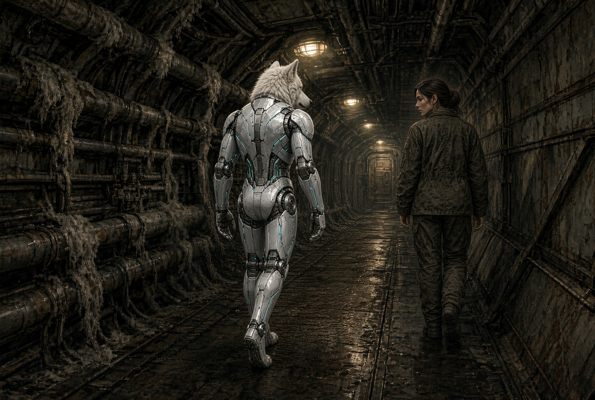
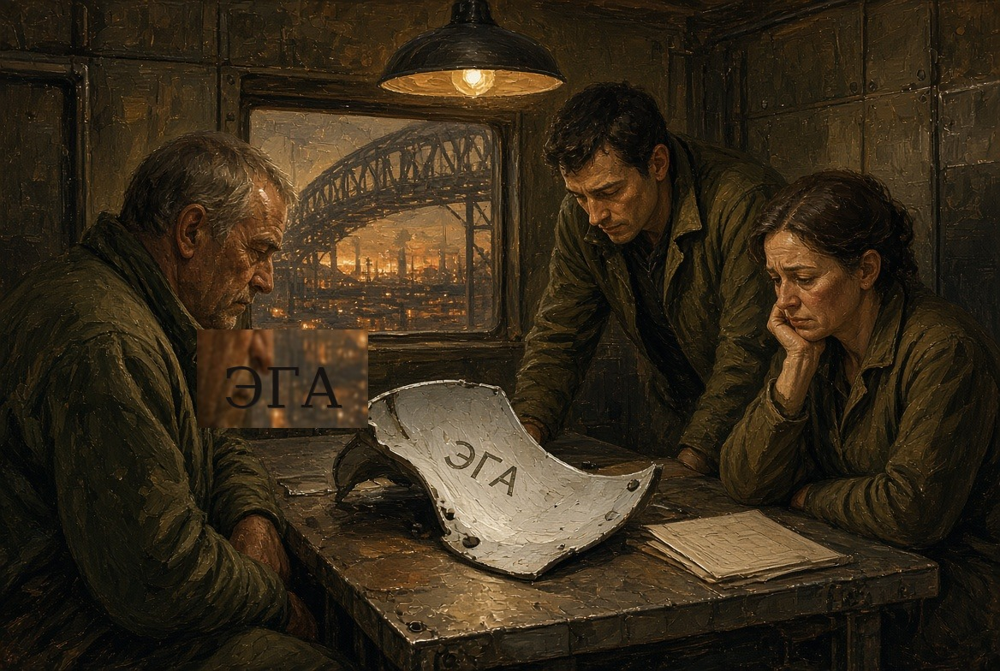
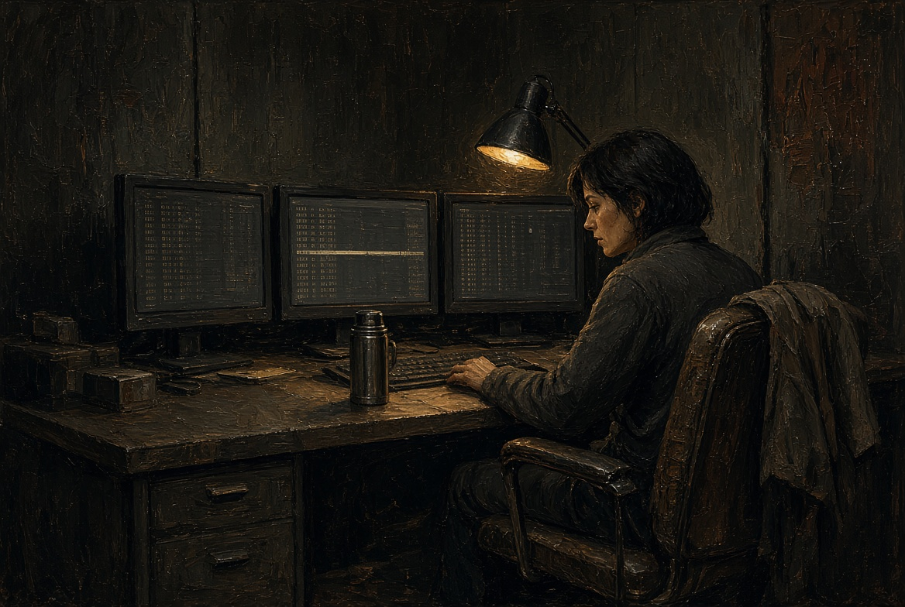
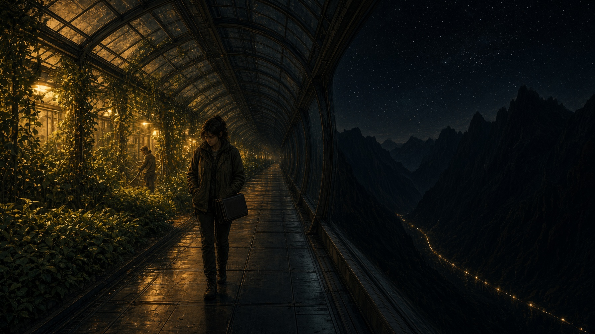
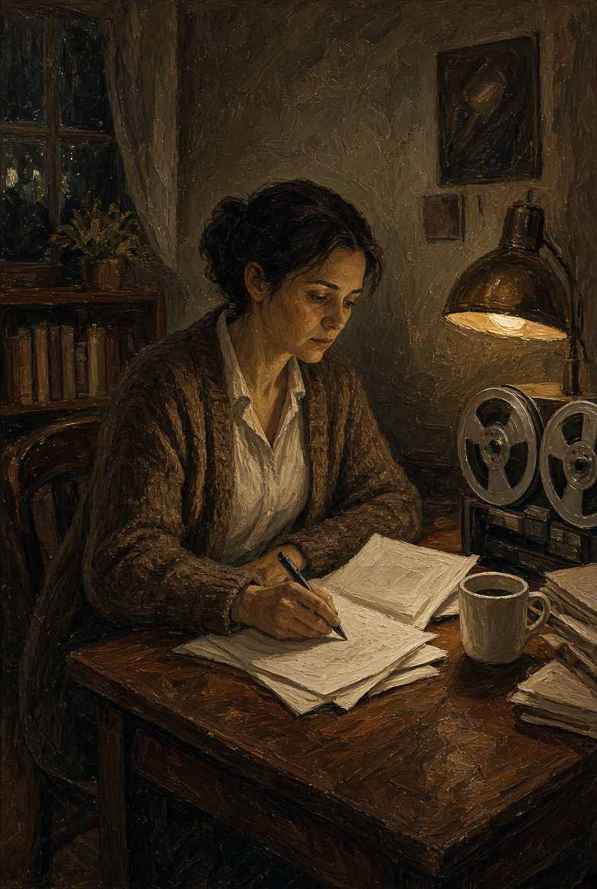
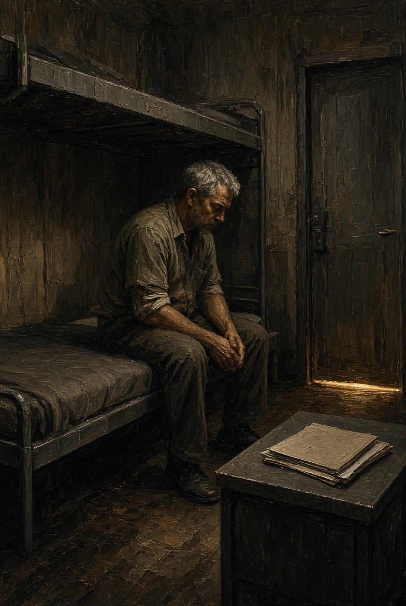

# NAEON. Предел
## Том I. Сеть
### Главы тринадцатая — пятнадцатая

---

## Глава тринадцатая. Закрытый состав

Комиссия собралась не в зале Совета, а в поперечном корпусе пояса, где на стенах ещё держалась краска старого склада. Идти туда от двора было минуты три, но коридор шёл под уклон, и к концу начинало закладывать уши: давление здесь держали чуть ниже, «для экономии на сварных швах корпуса», как было написано на жестяной табличке у гермодвери. Табличка залоснилась от пальцев; кто-то когда-то пытался отодрать у неё край, да так и бросил.

Айя шла первой, Эга — за ней, чуть боком, чтобы не задевать щитками трубы. Трубы тянулись вдоль потолка пучками, тёплые вперемешку с холодными: на холодных сидел серый пух конденсата, на тёплых темнели следы старых перчаток. Пахло мокрым асбестом, пайкой и сладковатым маслом из соседнего редуктора, а где-то за переборкой стучал насос — в своём ритме, не в такт шагам.

Перед дверью комиссии стояла скамья, у которой одну из ножек заменили обрезком трубы, да так и не покрасили. На скамье уже сидел человек в сером пиджаке Совета — не из семерых, а из аппарата. Он читал с планшета и, не поднимая глаз, сказал:

— Модуль — внутрь. Сопровождение — по вызову.

— Сопровождение входит сразу, — сказала Айя, — иначе модуль не войдёт.

Тут человек всё-таки поднял глаза, красные по краям, как после ночи над бумагами, но спорить не стал и кивнул на дверь.

Комната оказалась теснее, чем думала Айя. Потолок был низкий, а в двух окнах с иллюминаторными кольцами виднелся не космос, а соседняя ферма пояса — ребро, заклёпки, кусок антенны, — и дальше, если прижаться щекой к стеклу, тёплая каменная дуга пояса, которая уходила по кругу вокруг Цитадели и тонула в дымке над долиной. Посреди комнаты стоял стол, покрытый серой крошкой от старых чернил, с четырьмя стульями по одну сторону и одним по другую. Для Эги стула не поставили, зато у стены стоял высокий дворовый табурет, тот самый, на котором сидят, когда паяют снизу: кто-то догадался его принести. Айя узнала заусенец на ножке.

За столом сидели трое. Женщина лет пятидесяти, с короткой стрижкой и родинкой у губы, была председателем комиссии — не путать с председательствующей зала, да и голос у неё был ниже. Рядом сидел мужчина с тонким, почти косметическим имплантом за ухом: связь, а не перепись. Третьим был молодой протоколист, тот самый, что на стенде писал «нет» на поле бланка. Теперь он сидел прямо и старался не смотреть на Эгу как на чудо, но получалось плохо. Уши Эги чуть ушли назад, и он сразу уткнулся в ленту.

— Служебное обозначение «Эгида», индекс нулевой, — сказала женщина, не заглядывая в бумаги: она знала это наизусть. — Закрытый состав. Стенограмма не выходит в общий канал до решения. Сначала сверка: модуль подтверждает, что понимает вопросы на языке заседания.

— Понимаю, — сказала Эга.

Голос в этой комнате звучал иначе, чем на стенде: потолок был низкий, металл глушил низы, и слово вышло суше. Айя стояла у табурета, положив ладонь на спинку, и чувствовала под пальцами заусенец.

Женщина открыла папку, где лежали три листа: протокол стенда, выписка зала и приложение Лиры, уже с чужими подчёркиваниями.

— На стенде вы отказались повторить фразу теста. Повторите её сейчас, для сверки тракта. Речь не о присвоении функции, мы только проверяем, что тракт цел.

Эга посмотрела на Айю, но та не кивнула и не запретила — просто стояла.

— Фраза неверная, а тракт цел, — сказала Эга. — Я могу сказать другие слова: стол, труба, окно, Арк. Могу сказать даже ваше слово «гигиена». А фразу с листа не скажу.

Имплант за ухом у мужчины едва заметно мигнул, и тот, не глядя, записал что-то одним пальцем.

— Вас учили этому отказу? — спросила женщина.

— Меня учили ключам и креплениям, а отказ я сказала сама.

— Сопровождение подтверждало?

Айя ответила раньше, чем вопрос прозвучал до конца.

— Не подтверждала и не подсказывала. Если собираетесь записать подсказку, запишите и это.

Протоколист застрочил. За иллюминатором на антенну село что-то мелкое — то ли обрывок плёнки, то ли сухой лист из садовой шахты, занесённый вентиляцией, — покрутилось и улетело к ферме.

Дальше пошли вопросы скучные, как и положено в закрытом составе: кто собирал, сколько было линеек, где модуль стоит ночью, есть ли у него доступ к общему каналу. Эга отвечала коротко, иногда поворачивая голову к гулу насоса за стеной, будто сверялась с ним. Когда спросили про птичью линейку, она сказала:

— Птица повторила лист. Я смотрела, но повторять за ней не стала.

Женщина отложила папку и впервые оперлась локтями о стол — по-человечески, без позы.

— Есть сведения, что на изнанке щитка нанесено неслужебное слово. Снимите левый щиток.

Айя двинулась не сразу, но потом кивнула Эге, и та повернулась боком. Застёжки щитка Айя знала наизусть: две сверху, одна внизу, и средняя всегда тугая. Запахло тёплым металлом и её же кожей на подкладке — странный запах, не звериный и не машинный, скорее как от нагретой пыли. Щиток лёг на стол изнанкой вверх.

На серой краске маркером было выведено: ЭГА — неровными буквами, как пишут наскоро, упираясь бедром в верстак.

Мужчина с имплантом наклонился.

— Этого нет в реестре.

— Нет, — сказала Айя. — И в бланке нет, это изнанка. Снимете щиток на линии — прочитаете, а не снимете — значит, не ваше.

— Комиссия снимет, — сказала женщина, — и зафиксирует слово как факт. Модуль, это ваше имя?

— Для себя. Для бланка я Эгида, для зала у меня имени нет, а Эга — чтобы не быть только листом.

Насос в комнате стал слышен отчётливее. Протоколист перевернул ленту, и бумажный шорох показался громким.

Женщина долго смотрела на три буквы, потом закрыла щиток, как закрывают книгу, которую не купят.

— Решение закрытого состава. Гражданского имени нет. Служебное сохранить. Неслужебную метку не уничтожать и не вносить в общий реестр. Метку зафиксировать в закрытой описи. Модуль остаётся на опеке двора Уокер. Следующее окно — после приложения Венн по носителям, не раньше трёх недель. Разговоры модуля вне двора и вне периметра — только в присутствии сопровождения. Это не наказание, а порядок — пока Совет не знает, с чем имеет дело.

Эга слушала, наклонив голову, а потом сказала:

— Это снова позже.

— Да, — сказала женщина, и в её голосе впервые прозвучала усталость без казёнщины. — Сейчас вся Сеть живёт на «позже», так что вы не одни.

Айя вернула щиток на место и застегнула; пальцы на секунду задержались на изнанке, на чуть выпуклых буквах. Вышли тем же коридором. За гермодверью давление выровнялось, и в ушах щёлкнуло. Пиджака Совета на скамье уже не было: осталась только вмятина на доске да обрывок этикетки от пайки.

По дороге к двору Эга молчала и заговорила только у самого ложемента:

— Она смотрела на слово так, будто это опять ремонт. Буквы можно описать и сдать в опись, а лицо в опись не сдашь.

— Им так проще, — сказала Айя. — В бланк кладут то, что можно снять руками. Иди в стойло, я принесу воды.

Вода на дворе была из общего бака, с привкусом трубы. Эга пила медленно, отводя ухо от стука насоса, который здесь звучал уже по-другому, по-родному, на дворовой частоте. Внизу, за стеклом кровли, в садах зажигали вечернюю полосу — тёплую, жёлтую, а не циановую; циан оставался только тонкой ниткой на швах каркасов. Айя села на край стола и впервые за день вытянула гудевшие ноги. Комиссия кончилась, и ничего в мире не сдвинулось с места, кроме одной закрытой описи, куда теперь легло слово из трёх букв.

**Плата IX.** Коридор под уклон. Пучки труб, пух конденсата, спина Эги впереди, Айя сзади. Свет — грязный, от редких плафонов. Не героический ракурс.

**Плата X.** Стол комиссии. Щиток изнанкой вверх, три буквы. Три лица за столом, разные: усталость, любопытство, страх бланка. В иллюминаторе — ребро фермы, не звёзды.

**Секвенция.** Застёжка; щиток на столе; папка закрывается; гермодверь; вмятина на скамье.

---

## Глава четырнадцатая. Вторая лента

Частотная комната Ио жила по ночам иначе, чем днём. Днём сюда заходили с поручениями, скрипели обувью, просили «только глянь пакет», а ночью оставались три живых экрана, запах остывшего кофе из термоса и низкий гул самого пояса, которого днём не замечаешь. Когда по внешней ферме шли тележки, пол под креслом Ио слегка дрожал, и она научилась по этой дрожи понимать, какая идёт смена: тяжёлые ночью почти не ходили, так что тележка была либо ремонтная, либо из лазарета.

На стене висела старая бумажная карта узлов, ещё с карандашными стрелками. Живую карту зала сюда не тянули — у щитка не хватало допуска, — да Ио и не просила: ей хватало лент.

Был третий час ночи. Пинги шли ровно, как дыхание большого спящего: рудный пояс, садовый контур Арка, внешний насосный, архивный низ, и ответы короткие, служебные. Шахтёр из лазарета в эту ночь в эфир не выходил, но Ио на всякий случай держала его тембр в уголке экрана узкой полоской, для сравнения.

Она уже собиралась закрыть смену, когда садовый контур ответил на пинг, которого она снова не посылала. Журнал показывал исходящий служебный импульс с частотного стола, но импульса она не давала: руки у неё лежали на коленях.

Речь Ио включила не сразу. Сначала она ещё раз заглянула в журнал — так заглядывают в пустую кружку в надежде, что там остался чай, — потом сняла копию сырого пакета и только после этого пустила звук.

Голос был не шахтёрский, а женский, ровный, с лёгким придыханием, какое бывает у людей, которые работают в тепле и влаге, — сады. Слова встали в том же чужом порядке:

«Слышим мы. Поливка третьего держим. Смену не я. Дверь слышит.»

Последней фразы в первый раз не было.

Ио прокрутила ещё раз: «Дверь слышит». На дворе у Айи Эга стояла ушами к двери ещё до включения. С такой точностью Ио этого знать не могла, но слово «дверь» ударило в то же место, куда тогда ударило «не я».

Она записала время, узел и температуру канала. Руки не дрожали, дрожал пол — судя по ритму, шла тележка лазарета. Ио сидела, пока пакет сам не ушёл в архивную тень, как уходят одиночные сбои, а потом достала из ящика вторую катушку: первая уже лежала у Лиры. На эту она наклеила узкий пластырь, написала «сад / дверь» и заперла ящик ключом.

Идти через пояс ночью значит слушать, как живут трубы. Ио шла пешком, без капсулы: от частотной до архива этики было четыре лестницы вниз и одна длинная галерея над садами, застеклённая с обеих сторон. Слева лежал ночной Арк — кровли огородов горели тёплым жёлтым, и в просветах виднелись ряды, вода на листьях, редкие фигуры ночной поливки. Справа темнел внешний склон долины, над ним чёрной зубчатой полосой стояли хребты, и только внизу, у подножия опор, тянулась нитка внешнего освещения пояса. Ио остановилась посередине, прижимая катушку к боку под курткой. Стекло запотело от её дыхания; она провела по нему пальцем полоску и увидела в саду женщину со шлангом. Та подняла голову, словно что-то услышала — не Ио, а что-то в своих наушниках, — и снова нагнулась к корню.

Лира открыла с третьего стука — с распущенными волосами, в рабочей кофте поверх ночной рубахи. В комнате горела одна лампа над столом, а на столе лежало второе приложение, всё ещё с пометкой «ожидает окна».

— Второй случай, — сказала Ио с порога. — Садовый контур, голос другой, женский, а порядок слов тот же, что на рудном поясе. И в конце лишнее: «Дверь слышит».

Лира не спросила, почему ночью, а поставила катушку в тот же проигрыватель, что и в прошлый раз. Колонка хрипнула, и слова, войдя в комнату, сделали её меньше.

После второго прогона Лира села и положила ладони на приложение, как на крышку.

— Совет получит оба случая, — сказала она, — но завтра, а не сегодня в три часа ночи. Сегодня они назовут это сном линии и попросят тебя пойти лечь. А завтра у Каэля окно на узел, и он не сможет сказать, что ему некогда слушать.

— А если назовут эволюцией?

— Тогда я положу рядом протокол эмбриона и оговорку. Пусть увидят, что и там и здесь за того, кого нельзя спросить, отвечает кто-то другой: в клинике «да» за эмбрион ставит бланк, а на ночной поливке «мы» за человека говорит линия. Места разные, а согласие подменено одинаково.

Ио кивнула. Чаю Лира не предлагала: чайник был пуст, это было видно по опрокинутой крышке. Они ещё немного посидели под лампой. За стеной архива кто-то из ночной смены спускал воду — самый обычный звук, и от него почему-то стало легче, чем было после ленты.

Когда Ио ушла, Лира не легла, а открыла сейф, положила вторую катушку к первой и написала карандашом на внутренней стороне дверцы: «два». Ключ она снова повесила на шею; он был холодный, но быстро согрелся.

**Плата XI.** Частотная комната ночью. Три экрана, не фантастических, а плоских, с рядами цифр. Ио в кресле, куртка на спинке, термос. Полная тишина картинки, кроме одной вспыхнувшей строки на среднем экране.

**Плата XII.** Галерея над садами. Ио маленькая между двумя стеклами. Слева жёлтый сад и фигура со шлангом, справа чернота. Катушка под курткой — только прямоугольник у бедра, не светится.

**Плата XIII.** Комната Лиры. Ночная рубаха, кофта, лампа, две катушки уже рядом. Лицо без грима ужаса: просто человек, которому не дают дописать бумагу до утра.

---

## Глава пятнадцатая. Папка

Коротко. Ротт пришёл со смены, когда Тесс уже спала на боку, лицом к переборке. На столе стояла её чашка с осадком, а папка со снимками тракта по-прежнему стояла за шкафом.

Он вымыл руки до локтей, как в операционной, хотя дома в этом не было нужды, и сел на край койки, не включая свет. Из вентиляционной решётки тянуло холодом. За переборкой кто-то вполголоса смеялся — там шла чужая жизнь, поздняя, не их.

Ротт посмотрел на шкаф, потом на плечо Тесс и на тонкий белый шрам у линии роста волос, где когда-то ставили первое гнездо — ещё добровольно, ещё в шутку, «чтобы не выпадать».

Он встал, достал папку и положил на стол, но не открыл. Посидел так немного и убрал её обратно.

Утром, если кто-нибудь спросит его про шахтёра, он скажет просто: когда человеку портят память, он путает слова, повторяется, забывает, как его зовут, но не начинает вдруг ровно, как по учебнику, говорить «мы» вместо «я». Больная память так не выглядит; так выглядит чужая речь, вставленная в чужой голос.

Но это он сформулирует утром, а ночью он лёг рядом с Тесс и слушал, как ровно она дышит — пока ещё сама.

**Плата XIV.** Одна картинка. Тёмный отсек. Человек сидит на краю койки. Папка на столе закрыта. Свет — щель из коридора под дверью.

