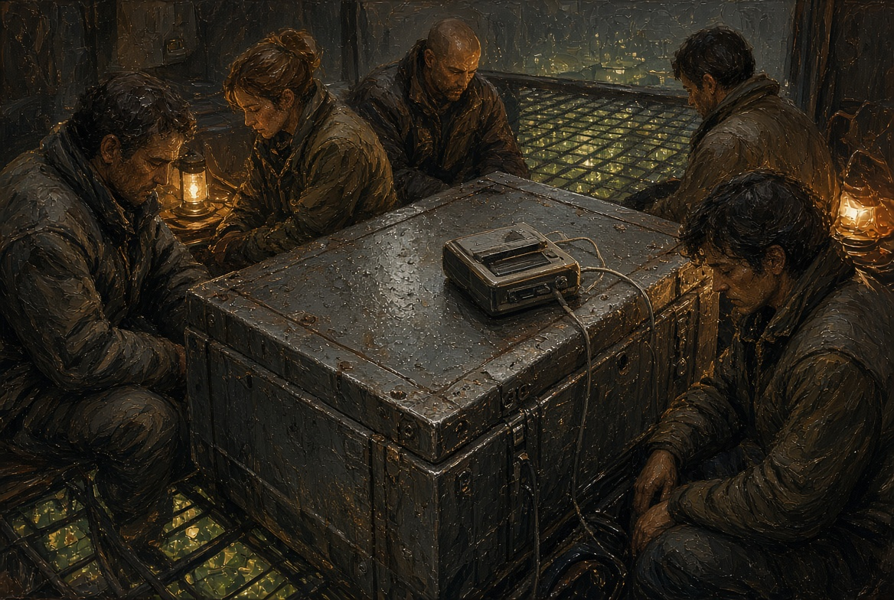
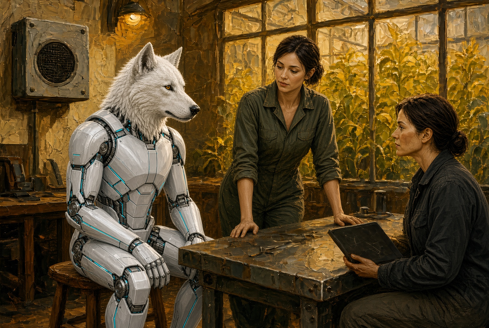
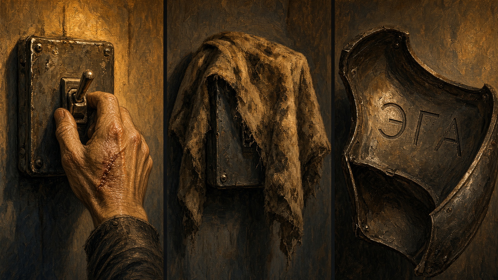

# NAEON. Предел
## Том I. Сеть
### Главы шестнадцатая — семнадцатая

---

## Глава шестнадцатая. Две катушки

Для разговора Каэль освободил кессон после приёмки узла. Зал Совета не годился: заседание собирает свидетелей и сразу превращает слушанье в голосование, а здесь было теснее и честнее. На полу ещё лежал обтирочный холст в масляных пятнах, на кожухе нового узла стыло тепло. Пахло озоном, как во всех кессонах пояса, только теперь к нему примешивался остывший кофе из термоса Ио.

Собралось их пятеро, хотя пятую Каэль не звал: Айя пришла сама, без Эги, и встала у двери так, чтобы не занимать стул. Лира положила на крышку кожуха сейфовую коробку, Ио — тяжёлый проигрыватель с ободранным углом. Ротт пришёл последним, в том же сером, в каком уходил на операции, с руками, вымытыми до локтя, и следом от резинки перчатки на запястье.

— Сначала правило, — сказал Каэль. — Здесь не заседание, и никто отсюда не выходит с формулировкой для табло. Слушаем, а потом каждый говорит своими словами, что слышал. Не «явление» и не «эволюция» — своими.

Лира кивнула, и Ио включила первую катушку.

Колонка была плохая. Сначала вылез служебный вызов, короткая сухая посылка без слов, какой связисты проверяют, жив ли дальний конец. Ио в ту ночь этого вызова не отправляла, но журнал всё равно числил его исходящим с её стола. После паузы пришла человеческая речь с рудного пояса, только порядок слов в ней был не тот, каким говорят люди на смене.

«Слышим мы. Фильтр третьего не бросаем. Смену не я.»

Каэль стоял, держась за край кожуха, и смотрел в пол. Ротт на втором такте закрыл глаза, как закрывают их, когда слушают пульс. Айя не шевелилась. Когда лента кончилась, в кессоне остался только вентилятор.

— Ещё раз, — сказала Лира.

Ио перемотала. Во второй раз «не я» прозвучало ещё отчётливее: ни запинки, ни пьяной речи, ни человека, который забыл, как его зовут, — ровная фраза, как будто у предложения был другой хозяин.

Вторую катушку Ио поставила, не оставив паузы на разговоры. На ней был садовый контур: женский голос с влажным призвуком, какой бывает в тёплых оранжереях, тот же порядок слов и лишнее в конце.

«Слышим мы. Поливка третьего держим. Смену не я. Дверь слышит.»

После последней фразы Айя впервые пошевелилась: её рука сжала косяк.

— «Дверь слышит» — так у нас на дворе говорили про Эгу, — сказала она. — Не в эфир, а вслух, между своими, когда она ещё стояла под плёнкой и держала уши назад. Откуда это мог взять кто-то с садового контура?

— Никто из ваших в журнале садового пинга не значится, — сказала Ио. — Я ночью смотрела. В смене поливки три человека: двое по графику спали, а третья была внизу со шлангом, я её видела из галереи. Наушники у неё садовые, не поясные, и ходить на двор Уокер этой женщине не с чего.

Ротт открыл глаза.

— Шахтёра я собирал в первую неделю после зала: узел памяти у виска сел у него во время смены, и я вернул дорожку, по которой он помнит насос и своё имя. Когда человек после такой правки говорит плохо, это видно сразу — он повторяет одно слово, путает смену с годом, ищет своё имя и не находит. А шахтёр в лазарете ест кашу и ругается на насос, как раньше. На ленте не он: тембр общий, без горла.

Каэль наконец сел на ящик из-под крепежа, и тот крякнул.

— Два разных места, рудник и сад, — сказал он, — и два разных голоса, а ломаная речь одна и та же. Исходящий вызов в журнале есть, а живого отправителя нет. Если я понесу это в зал как есть, одна половина скажет «сбой журнала», а другая попросит назвать это новым свойством Сети и подведёт под него гигиену. Мне не нравятся оба ответа.

Лира положила ладонь на коробку.

— Я не прошу зала сегодня. Я прошу окно на второе приложение и запрет клинике трогать эмбриона, пока неясно, куда садится эта речь: мою оговорку они уже процитировали наоборот. Если «мы» входит в канал без спроса, то посадка гнезда без спроса — никакая не гигиена, а открытая дверь.

Слово «дверь» неловко повисло в воздухе. Айя хмыкнула без смеха.

— На дворе я Эгу в общий канал не пускаю, — сказала она. — После комиссии разговоры вне периметра у неё только при мне. Если эта речь ищет тех, кто слышит дверь, мне надо знать, не ищет ли она каркас.

— Завтра поставь её на глухой контур, без выхода в сад и на рудник, — сказал Каэль. — Ио снимет фон. Если «мы» придёт и на глухой контур, значит, дело уже не в дальней смене.

Ротт встал.

— Я ещё раз схожу к шахтёру. Не резать, а послушать, как он говорит, когда не думает, что его записывают. Если «мы» появится у него в живой речи — это одно, а если только на ленте — совсем другое.

Лира закрыла коробку.

— Катушки остаются у меня, копии — у Ио. В общий фонд ни строчки, пока не будет третьего случая или пока Каэль сам не решит, что молчание опаснее заседания. Молчание ведь тоже чего-то стоит, я это вижу.

Каэль кивнул — не как голос Совета, а как человек, который только что принял узел и понял, что узел отвечает не ему одному.

Выходили по одному. В кессоне остались холст, запах озона и тёплый кожух, а внизу за ограждением тянулись те же сады, и в них ничего не переменилось. Переменилось одно: теперь пятеро слышали одну и ту же ломаную фразу, и сделать вид, будто её нет, не мог уже никто.

**Плата XV.** Кессон крупно. Пять человек, разные позы, один проигрыватель на крышке кожуха. Свет рабочий.

**Секвенция.** Первая лента — рот колонки; лица; вторая лента — рука Айи сжимает косяк двери; Каэль садится на ящик; коробка закрывается.

---

## Глава семнадцатая. Глухой контур

Глухим контуром на дворе называли отдельную жилу связи, которая никуда не выходила: ни в сад, ни на рудник, ни в зал. Провод шёл от стойла к ящику на стене и в нём обрывался. Ио принесла ящик утром, сама его прикрутила и обмотала стык синей изолентой — не для красоты, а просто потому, что синяя была под рукой.

Эга сидела на табурете, а Айя пристроила на столе второй проигрыватель, маленький, дворовый. После вчерашнего кессона запах двора казался почти домашним: нагретый сплав, мокрая ветошь, чей-то недоеденный хлеб на подоконнике.

— Говори что хочешь, только в эту жилу, — сказала Айя. — Если кто-нибудь ответит не с этой стены, Ио увидит.

— А если никто не ответит?

— Тем лучше.

Эга помолчала, а потом стала называть вещи на столе, как в комиссии: ключ, лоток, хлеб, окно. Голос уходил в ящик и гас там, и экран Ио оставался ровным.

Минут через двадцать Эга заговорила уже не о вещах.

— Я Эга, не лист. Слышу насос. Слышу дверь.

Айя взглянула на Ио, и та покачала головой: ни исходящего в сад, ни входящего — только петля двора.

На тридцать четвёртой минуте экран моргнул: короткий служебный вызов. Журнал писал, что вызов вышел из ящика на стене, хотя Ио его не давала, а Эга сидела с закрытым ртом.

Несколько секунд ответа не было. Потом из тихого дворового проигрывателя прозвучал тот же порядок слов, уже без садового придыхания и без шахтёрской хрипотцы, — голос был общий, как тогда на первой ленте.

«Слышим мы. Дверь держим. Смену не я.»

Эга встала так резко, что табурет отъехал. Айя не крикнула: она подошла и выключила ящик одним щелчком, и тишина после щелчка оказалась толще гула.

— Это не я, — сказала Эга очень отчётливо, по-человечески, с ударением на «я». — Я рта не открывала.

— Знаю, — сказала Айя. — Сиди.

Ио смотрела в журнал; пальцы, которыми она держалась за край стола, побелели.

— Вызов опять числится исходящим отсюда, а живого отправителя нет, и приём — на эту же петлю. Значит, речь уже не только на руднике и в саду: она умеет отвечать туда, куда её не звали, если в комнате произнесли «дверь».

Айя посмотрела на Эгу. Та держала уши назад, к гермодвери двора, и игры в этом не было.

— Стойло держим без общего канала, — сказала Айя. — Смену птичьей линейки на сегодня я закрываю. Комиссию не дёргаем, а Каэлю и Лире сообщаем сейчас, не вечером.

Она сказала это спокойно, потому что крик на дворе ничего не чинит: кричат, когда сломалось насквозь, а пока сломалась только тишина в одной жиле, которой полагалось быть глухой.

Внизу, за стеклом кровли, лежали обычные сады: жёлтый свет, ряды, вода. Женщины со шлангом, той ли самой или другой, сейчас видно не было. Над садами стояла утренняя муть, пояс работал, и доски нужды на площади наверняка уже горели первой строкой про белок и про смену на внешнем узле.

Эга села обратно и поправила щиток — тот самый, с изнанки которого не стёрлось имя.

— Если они держат дверь, — сказала она, — то чью?

Айя ответила не сразу. Она взяла ветошь, которой недавно вытирала стол, и положила её на ящик, как кладут тряпку на то, чего пока не хотят видеть.

— Этого мы ещё не знаем, — сказала она. — И пока не узнаем, ты слово «дверь» вслух не повторяешь — ни здесь, ни на поясе. «Я» я тебе не запрещаю, я запрещаю звать того, кто отвечает без рта.

Эга кивнула — коротко и понятно. Ио уже паковала катушку, а синяя изолента на стыке отклеилась уголком и торчала в воздух, как несделанная работа.

**Плата XVI.** Двор утром. Ящик на стене, синяя изолента, Эга на табурете, Айя у стола, Ио с экраном. Из проигрывателя идёт речь, а рот Эги закрыт.

**Плата XVII.** Крупно рука Айи на выключателе ящика. Следующий кадр — ветошь, наброшенная на крышку. Третий — изнанка щитка с тремя буквами.

