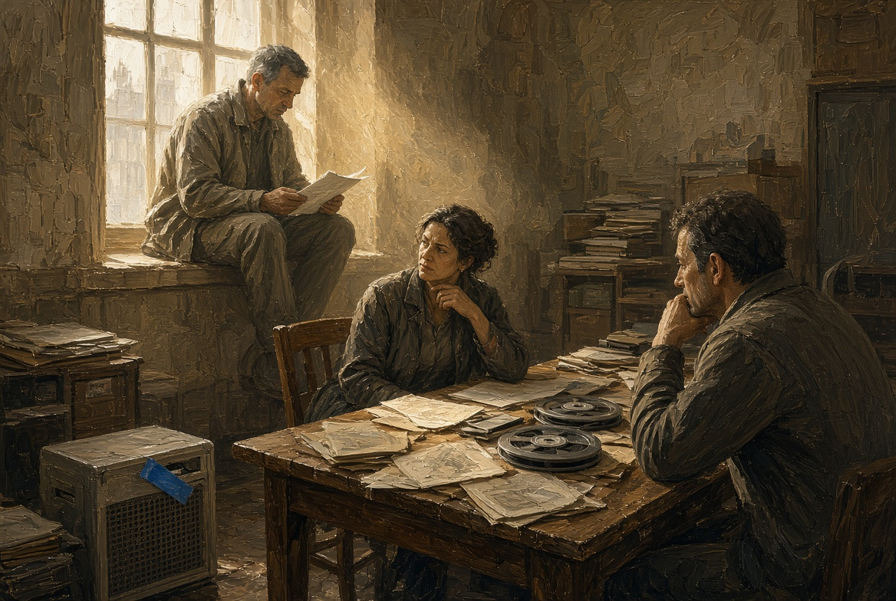
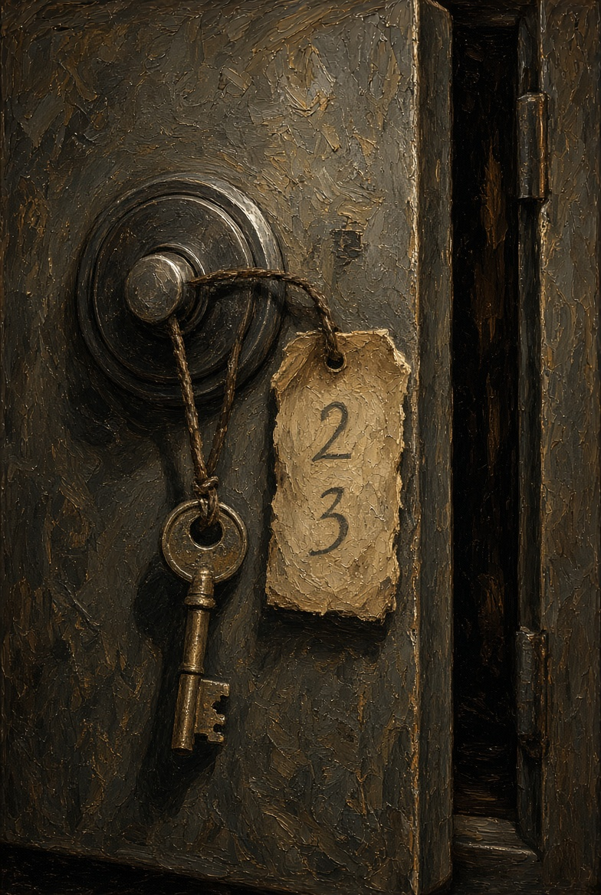
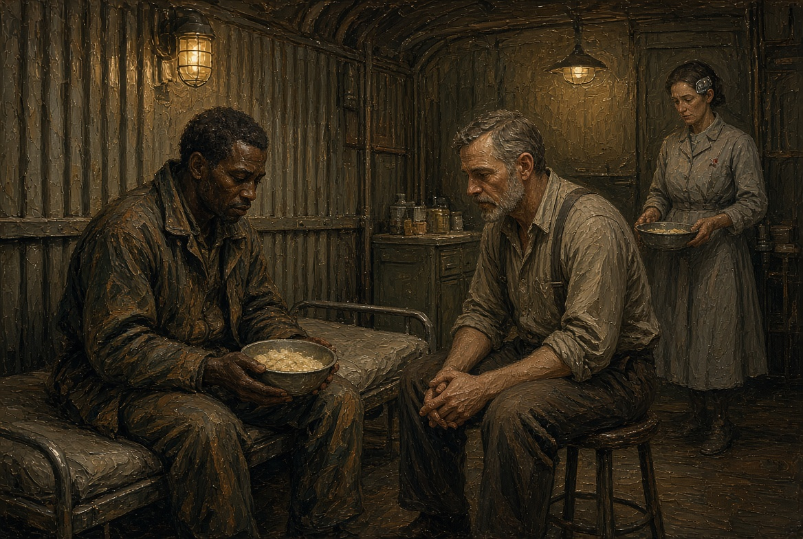
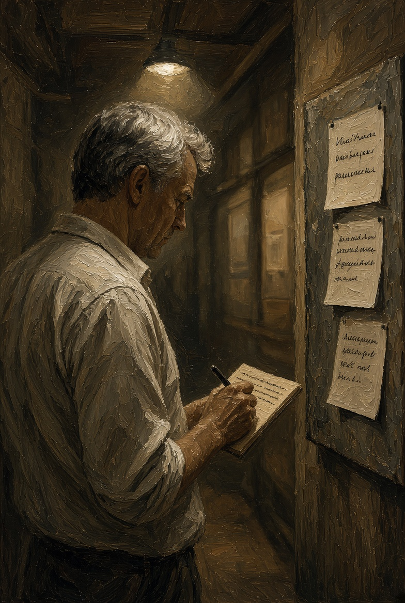
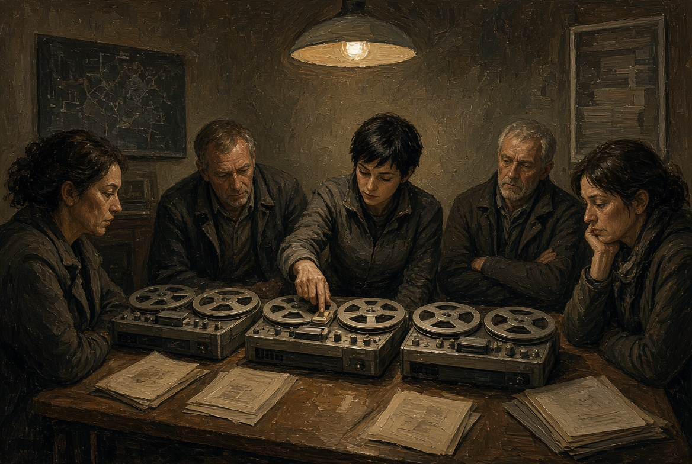

# NAEON. Предел
## Том I. Сеть
### Главы восемнадцатая — двадцатая

---

## Глава восемнадцатая. Не вечером

Айя не стала ждать лифта. От двора к архиву этики вниз вели четыре лестницы, и на каждой площадке пахло по-своему: на первой — нагретым маслом редуктора, на второй — пылью из вентиляционного короба, а с третьей уже тянуло бумагой и холодным чаем, какой оставляют в архиве на ночь в кружках без подписи. Ио шла следом, прижимая катушку к рёбрам под курткой. Эгу Айя оставила в стойле, а ящик с синей изолентой сняла со стены и унесла с собой в сумке, так что жила, которой не полагалось никуда выходить, теперь ехала с ними как улика, а не как инструмент.

На площадке третьей лестницы Ио остановилась перевести дыхание. В узком окне без рамы виднелись только кромка садовой кровли и кусок жёлтого света, а в нём дрожал лист, прилипший к стеклу изнутри оранжереи.

— Если Каэль снова скажет «не созывать заседание», — сказала Ио, — я не знаю, куда ещё нести третью ленту.

— Тогда своё слово скажет Лира, — ответила Айя. — Пойдём.

Архив к этому часу уже работал. За стойкой регистратора сидела старшая по архиву, седая женщина с коротким ёжиком; она узнала Ио, пропуска не спросила и только кивнула на коридор:

— Венн у себя, Ордин пришёл двадцать минут назад, прямо с узла. Только не кричите, у нас переплёт.

Днём комната Лиры выглядела беднее, чем ночью. Лампа над столом была выключена, свет падал из единственного высокого окна, и пыль в нём стояла столбом. На столе лежали второе приложение, всё ещё с пометкой «ожидает окна», сейфовая коробка и кружка с осадком. Каэль сидел на подоконнике, скинув куртку, в серой рабочей рубахе с тёмным пятном смазки у локтя; в руках он держал планшет приёмки узла и, кажется, только что спорил.

Айя поставила сумку на пол и вынула ящик; синяя лента висела на нём лохмотьями.

— Глухая жила ответила, — сказала она. — Эга рта не открывала, а Ио всё сняла.

Лира сразу встала, а Каэль остался сидеть и только положил планшет на подоконник стеклом вниз, как кладут вещь, к которой ещё вернутся.

Ио ничего объяснять не стала: вставила катушку и убавила звук, чтобы он не летел за стену, где шёл переплёт. Сначала опять прозвучал короткий служебный вызов без слов, и журнал на её планшете, прислонённом к кружке, показал исходящее с дворового ящика, а потом пришёл тот же чужой порядок слов, знакомый уже до оскомины.

«Слышим мы. Дверь держим. Смену не я.»

После этой фразы несколько секунд было слышно только, как за стеной архива ходит переплётный пресс — тяжело и ровно. Каэль смотрел не на колонку, а на ящик.

— Эга этого не произносила, — сказала Айя. — Говорила она раньше, когда мы проверяли жилу: назвала ключ, хлеб, окно, потом сказала «слышу дверь». После этого вызов вышел сам, и ответ пришёл в ту же петлю. Я выключила ящик руками.

Лира открыла сейф, не снимая ключа с шеи, и положила третью катушку к двум первым. На внутренней стороне дверцы карандашом уже стояло «два»; она приписала под ним «три», ровно и тем же нажимом.

— Одного окна на приложение мне теперь мало, — сказала она Каэлю. — Речь входит в комнату, которую мы сами отрезали от сада и от рудника. Если зал узнает об этом по слухам и дворовым сплетням, источником назовут каркас: Айю снимут с допуска, Эгу разберут, и ленты после этого уже никто не станет слушать спокойно.

Каэль потёр пятно смазки на рукаве, будто его можно было стереть.

— Если я созову заседание сегодня, — сказал он, — сменные голоса с пояса потребуют либо глушить дальние узлы, либо сажать гнёзда ещё чаще, раз «гигиена» уже принята. И то и другое я умею посчитать: глушить — значит резать работу рудника и поливки, а сажать чаще — значит шире открывать ту самую дверь, о которой вы просите не говорить вслух. Мне нужно что-то третье.

— Третье — это запрет клинике и снятие каркаса с общего канала до разбора, — сказала Лира. — И не полное заседание Совета, а закрытая группа: ты, я, Ио с лентами, Ротт с шахтёром, Уокер с каркасом. И ещё председатель комиссии по Эгиде.

Айя кивнула.

— Её можно: она уже видела три буквы на изнанке щитка и стенограмму наружу не вынесла. Только Эгу на общее собрание не ведите. Она слышит слишком хорошо и повторяет не то, что стоит повторять залу.

Каэль помолчал. Из окна был виден кусок пояса и далёкая точка кессона, где он утром принимал узел; узел наверняка уже теплел на живой карте, и люди там работали, ничего не зная про три катушки.

— Значит, закрытая группа, сегодня к вечеру, в комнате комиссии, а не в зале Совета. Председателя комиссии я вызову сам, а Ротта зови ты, Лира. Ио готовит три ленты в одном порядке: рудник, сад, двор. Комментариев на полях не нужно, комментарий скажем голосом.

Он взял планшет с подоконника, экран загорелся скучным списком приёмки, и Каэль выключил его.

— И ещё: слово «дверь» в закрытой группе тоже без нужды не произносить. Мы уже видели, чем это кончается.

Ио застегнула куртку поверх копии. Айя подняла ящик вместе с серой дворовой ветошью, пахнувшей столом. Лира закрыла сейф, и ключ стукнул её по ключице под рубашкой — короткий, домашний звук.

**Плата XVIII.** Комната Лиры днём. Столб пыли из высокого окна. Трое у стола, Каэль на подоконнике, ящик с изолентой на полу.

**Плата XIX.** Дверца сейфа крупно. Карандашные «два» и «три». Ключ на шнурке.

---

## Глава девятнадцатая. Каша и не каша

Лазарет внешнего пояса занимал бывший холодильник для сплава: низкий потолок, стены ещё с рёбрами под мороз, хотя мороза здесь давно не держали. Вместо холода стояла тёплая духота, пахло йодом, кашей и мокрым ватником. Из шести коек на четырёх спали, а на пятой сидел шахтёр, тот самый, с насоса, и ел из железной миски, придерживая её край большим пальцем с чёрным ногтем.

Ротт пришёл без халата, который в этом помещении выглядел бы насмешкой, и сел на табурет у койки так, чтобы не загораживать проход санитарке, нёсшей бак с водой.

— Память на месте? — спросил он.

Шахтёр кивнул, не переставая жевать.

— Насос помню, фильтр помню, тебя помню. Как сознание терял — не помню, да и не надо.

— Имя своё скажи.

— Дор Нак. Смена третья, внешний пояс, насосная. Жена на Арке, нижний ярус, сад два. Ты это уже спрашивал.

— Спрашиваю ещё раз.

Дор пожал плечами и доел кашу; миска оставила на одеяле мокрый круг. Он вытер рот тыльной стороной ладони и вдруг усмехнулся:

— Санитарка мне тут ночью говорит: ты во сне бормотал «мы». А я говорю — враки. «Мы» — это смена, мы так у насоса и говорим: «Мы держим». Ты не с рудника, тебе не понять.

Ротт не стал спорить про рудник.

— А кроме сна? Днём, когда ешь, когда орёшь на насос — «мы» или «я»?

Дор подумал дольше, чем нужно для простого слова.

— Днём — я, а ночью не знаю. Санитарка старая, ей всюду чудится. У неё у самой гнездо вот тут, — он ткнул себя в висок, в то самое место, куда Ротт сажал дорожку памяти, — с гигиены. Ей теперь все сны общие, она так шутит.

Санитарка как раз вернулась с баком — сухая женщина лет шестидесяти в серой косынке. У левого виска под волосами у неё блестела узкая пластина, то самое гнездо связи, которое постановление назвало гигиеной Сети. Услышав последние слова, она фыркнула.

— Не шучу я. Он в три часа ночи сел на койке и ровно так сказал: «Смену не я». Потом лёг и захрапел. Я тридцать лет в лазарете, и бред после правки памяти бывает другой: там человек ищет мать и путает год. А этот сказал фразу ровно, как заученную, слов не искал.

Ротт посмотрел на Дора, а тот смотрел в миску.

— Я этого не помню, — сказал он уже тише. — Если сказал, не злитесь. Я Дор, а не «мы».

— Я не злюсь, — сказал Ротт. — Лежи, насос без тебя пока не встанет.

В коридоре лазарета было холоднее. Ротт остановился у ребра стены, где когда-то крепили морозные трубы, и достал из кармана короткий блокнот, не сетевой. Он записал три строки: санитарка слышала ту же фразу живьём; сам Дор днём помнит имя; гнездо у санитарки уже стоит. Потом закрыл блокнот. Диагнозом это не было — только тем, что вечером надо сказать закрытой группе, без догадок.

По дороге к жилому ярусу он прошёл мимо доски нужды. Первой строкой шёл белок на нижний сад, второй — два человека на внешний насос, а третьей, мелкой, только сегодняшней: «клиника третьего пояса, очередь на частичную правку, места есть». Очередь, которую Лира просила закрыть, всё ещё горела, как будто ночь с катушками прошла мимо доски.

**Плата XX.** Лазарет в бывшем холодильнике. Рёбра на стенах. Шахтёр с миской. Ротт на табурете. На заднем плане санитарка с баком, у виска узкая пластина.

**Плата XXI.** Коридор. Ротт пишет в бумажный блокнот. За его плечом, не в фокусе, доска нужды с тремя строками.

---

## Глава двадцатая. Перед дверью

К вечеру комнату комиссии заняли раньше срока. Это была та же комната, с иллюминаторами на ферму и со скамьёй в коридоре, у которой вместо одной ножки стоял обрезок трубы. Председатель комиссии пришла первой и велела протоколисту сидеть в соседней клети: у стенограммы закрытой группы не должно было появиться своего молодого человека с аккуратными руками.

Лира расставила на столе три катушки в ряд, слева направо: рудник, сад, двор. Ио проверила звук на самой тихой громкости. Айя села у стены, поставив сумку с ящиком у ног, Ротт положил рядом с катушками блокнот, не открывая его раньше времени, а Каэль стоял у иллюминатора и смотрел, как по ферме ползёт тележка с баллонами.

Женщина с родинкой у губы закрыла дверь сама, никого не зовя из аппарата.

— Сначала слушаем, потом говорите, — сказала она. — А если кому-то понадобится слово, от которого у вас в прошлый раз ожила жила, произнесите его по буквам или замените. Я не фокусница и не хочу, чтобы в этой комнате включилось то, чего мы сюда не звали.

Никто не спорил. За переборкой опять стучал насос, не в такт дыханию. Каэль кивнул Ио, и она положила палец на клавишу первой ленты, но ещё секунду не нажимала — в эту секунду было слышно, как кто-то сглотнул. Потом клавиша ушла вниз.

**Плата XXII.** Стол комиссии вечером. Три катушки в ряд. Палец Ио над клавишей. Лица тех, кто сейчас начнёт слушать.

