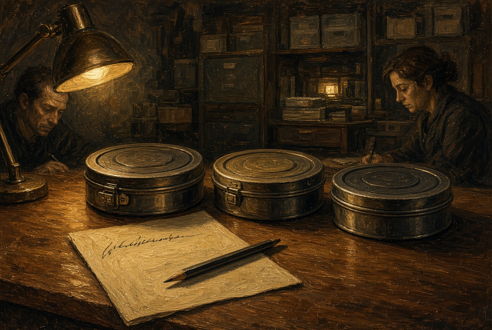
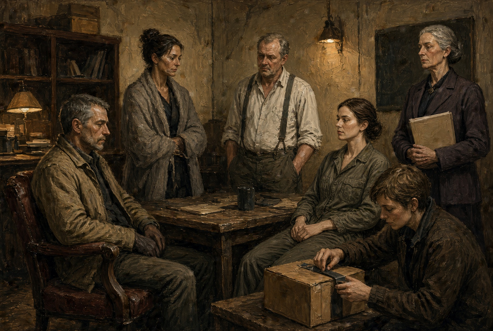
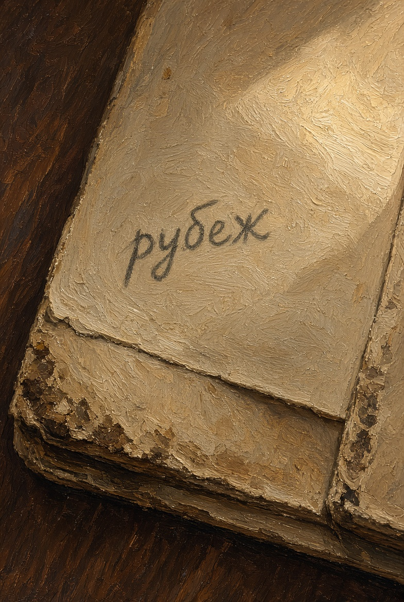
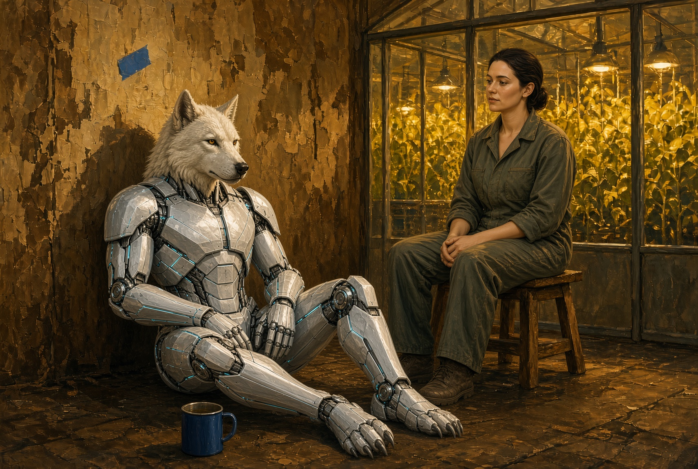

# NAEON. Предел

## Том I. Сеть

### Главы двадцать первая — двадцать третья

---

## Глава двадцать первая. Три ряда

Первая лента в этой комнате звучала тише, чем в кессоне: стены глушили звук, и голос с рудника выходил плоским, без хрипа. Сначала прошёл короткий служебный вызов без слов, потом была пауза, а потом тот порядок слов, который они уже знали наизусть.

«Слышим мы. Фильтр третьего не бросаем. Смену не я.»

Женщина с родинкой у губы не писала, пока фраза не кончилась: карандаш висел над бумагой и опустился только после паузы. На поле она поставила одно слово — «рубеж», не казённое, а пометку для себя, что здесь кончается обычный эфир.

Ио переложила катушку, не глядя на лица. Вторая лента была теплее: садовый контур, влажный призвук оранжереи, женский голос — и тот же чужой порядок слов. В конце прозвучало лишнее, то самое, чего они условились без нужды не повторять вслух; впрочем, повторять и не требовалось — все в комнате и так услышали. Айя смотрела на сумку с ящиком у своих ног, Каэль — в иллюминатор, где по ферме ползла тележка с баллонами, уже ближе к стыку.

Третья лента оказалась самой короткой и хуже всех по звуку: дворовый проигрыватель, щелчок, жила, которой не полагалось никуда выходить. Голос был уже без рудничной хрипотцы и без садового тепла — ровный, общий.

«Слышим мы. Дверь держим. Смену не я.»

После третьей ленты Ио не стала спрашивать, повторять ли, а просто выключила. В тишине снова стал слышен насос за переборкой. Председатель комиссии отложила карандаш.

— Каркас тут ни при чём, — первой сказала она. — Я слушала его на закрытом составе: он отказывается читать фразу с листа и называет предметы на столе. А здесь другое. Одно и то же предложение приходит с трёх концов Сети, а на дворе — ещё и из жилы, которую Уокер отрезала руками. Источник не двор, двор только отозвался.

Ротт открыл блокнот.

— Шахтёр Дор Нак днём помнит своё имя, насос и жену на нижнем ярусе; после правки памяти он слов не путает. Санитарка лазарета — у неё у виска гнездо связи — ночью слышала от него живьём ту же фразу, что на первой ленте, а сам Дор этого не помнит. Сравнивает санитарка не с нашими катушками: она тридцать лет слушает бред после правок, где ищут мать и путают год. А тут фраза ровная, как заученная.

Он закрыл блокнот и больше ничего не добавил. О гнезде санитарки он сказал только то, что видел сам: узкая пластина у виска, поставленная по постановлению о гигиене Сети.

Лира сидела прямо, положив ладони на край стола.

— Три места — рудник, сад, двор — и один порядок слов, а живого отправителя в журнале нет. В клинике третьего пояса тем временем стоит очередь на частичную правку тех, кого ещё нет на свете, а моё второе приложение всё ещё ждёт окна в календаре Совета. Если мы выйдем отсюда и промолчим ещё неделю, очередь ждать не станет.

Каэль отошёл от иллюминатора; тележка на ферме уже скрылась за стыком.

— С лентами я не спорю, — сказал он, — я спорю с тем, что сделает зал. Сменные голоса с пояса услышат про речь без рта и потребуют либо выключить дальние точки, либо сажать гнёзда чаще. Выключим канал — к ночи встанет насос и остановится поливка; станем сажать чаще — расширим ту самую посадку, которую уже назвали гигиеной. Я сегодня на узле считал оба хода, и оба плохие. Для заседания нужна третья формулировка — без слова, от которого у вас оживала жила, и без слова «эволюция».

Ио, до сих пор только ставившая ленты, заговорила не о журнале.

— Формулировка есть. Назовём это аномалией канала: служебный вызов уходит без оператора, а с трёх концов приходит ответ с чужим порядком слов. А кто говорит — вслух не гадать: догадку зал допишет сам, стоит только дать ему лишнюю минуту.

Женщина с родинкой кивнула.

— Это язык комиссии, а не заседания, так и несите. Каркас в доклад не ставьте. Уокер, ваш двор закрыт для общего канала, пока я сама не сниму запрет. Считайте это не наказанием, а просто отключением от канала.

Айя кивнула: ящик со стены она сняла ещё утром.

**Плата XXIII.** Три катушки после прослушивания, крышки закрыты. Карандаш на бумаге, одно слово на поле. Лица не в ужасе — за работой.

---

## Глава двадцать вторая. Третья формулировка

Спорили негромко: низкий потолок сразу возвращал голос, и крик здесь вышел бы попросту стыдным. Каэль ходил от стола к иллюминатору и обратно — четыре шага туда, четыре обратно, — и на четвёртом проходе Лира сказала:

— Окна в общей очереди я больше не жду. Завтра ты ставишь приложение вне очереди. Запрет клинике трогать тех, кого нельзя спросить, должен действовать с утра, даже если Совет ещё не слушал лент: это бумага этики, а не голосование семерых.

Каэль остановился.

— Без решения зала клинику я не закрою: у неё свой регламент и свой пояс. Могу поставить внеочередной вопрос и приложить твой текст, но голос у меня один. Четыре против трёх по каркасу ты помнишь, шесть против одного по гигиене — тоже.

— Помню, — сказала Лира. — Поэтому в доклад не кладём ни каркаса, ни слова «мы» как лозунга, а кладём журнал вызовов и три отметки времени. Пусть смотрят на часы, а не на философию.

Ротт стоял у стены, сложив руки так, как складывают после операции, когда мыть уже нечего.

— Санитарку я ещё раз пугать не стану, — сказал он. — Гнездо у неё уже стоит, и снимать его без запроса нельзя. Могу спросить, согласна ли она, чтобы я послушал, что ночью приходит к ней в наушник; не согласится — не стану слушать. Это ведь не лента Ио, а её собственное ухо.

— Спрашивайте письменно, — сказала женщина с родинкой, — а копию мне, в закрытую опись.

Айя всё ещё сидела у стены, и сумка касалась её сапога. Когда очередь дошла до двора, она сказала только то, что могла сказать по работе.

— Птичью линейку я не открою, пока жила снята. Каркас ночует в стойле, без выхода в сад и на пояс, и разговаривает только со мной. Слово, от которого у ящика пошёл ответ, он повторять не будет — это я сказала ему ещё утром, не на заседании.

Каэль наконец сел на чужой стул.

— Завтра утром я прошу внеочередной вопрос. Формулировка Ио — аномалия канала, приложение Венн идёт вторым листом. Целиком ленты в зале не крутим: если потребуют звук, дадим первую минуту первой катушки, а остальное остаётся в закрытой описи комиссии. Кто захочет слушать все три ряда, пусть идёт сюда, а не на площадь.

Лира не улыбнулась, а кивнула так, будто ставила ещё одну звёздочку, — только уже не на поле оговорки.

— Этого мало, но больше из этой комнаты не выжмешь.

Женщина с родинкой собрала три листа в папку; на верхнем так и осталось слово «рубеж».

— Группу не распускаем, — сказала она. — После заседания все снова сюда, даже если Совет скажет, что это сбой в журнале. Ловить четвёртую ленту по дворовым слухам я не хочу.

Ио уложила катушки в коробку в том же порядке — рудник, сад, двор, — и крышка легла плотно. За иллюминатором ферма уже ушла в тень, а насос за переборкой стучал по-прежнему, не попадая в такт шагам вставших из-за стола людей.

**Плата XXIV.** Каэль на чужом стуле, Лира стоит, Ротт у стены, Айя не встаёт до конца. Ио закрывает коробку. Председатель комиссии держит папку.

**Плата XXV.** Край папки и карандашная пометка «рубеж». Без поясняющей ленты поверх кадра.

---

## Глава двадцать третья. Стойло

Коротко. Айя вернулась на двор, когда смену уже развели. Стол был вытерт, хлеб с подоконника кто-то доел, а на стене вместо ящика остался только клочок синей изоленты, прилипший к краске.

Эга сидела в стойле на полу, спиной к переборке, со щитком на месте, и, едва Айя вошла, повернула уши не к двери, а к ней.

— Слушали? — спросила она.

— Слушали. Завтра на заседание понесут не тебя, а запись канала, время меток и бумагу Лиры. А тебе сидеть здесь.

— Я слово не говорила.

— Хорошо.

Айя села на табурет, который утром отъезжал по полу; ноги гудели от лестниц. Она налила из бака воды в железную кружку, выпила половину, а остальное поставила на пол для Эги. Вода, как всегда, пахла трубой.

За стеклом кровли в садах уже включали вечернюю полосу — жёлтый свет над рядами. Доски нужды на площади отсюда видно не было, и Айю это устраивало. Завтра очередь клиники, скорее всего, ещё будет гореть на табло до самого голосования, а сегодня на дворе стояла тишина, и проверять её новым ящиком Айя не стала.

**Плата XXVI.** Стойло вечером. Эга на полу, кружка, клочок синей ленты на стене. Айя на табурете — просто сидит.

