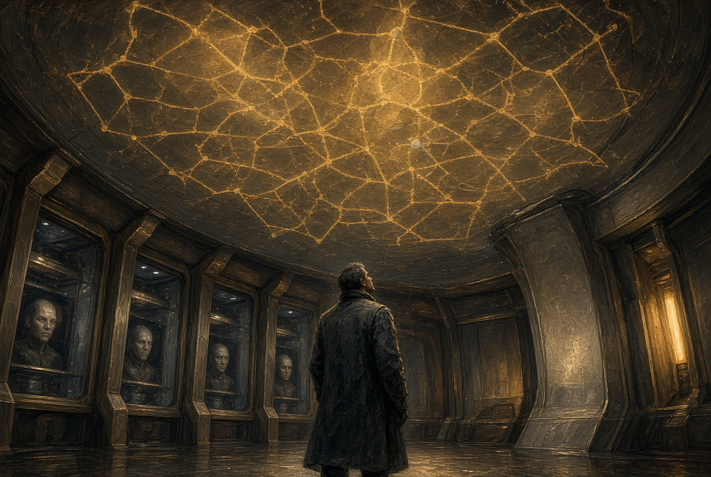
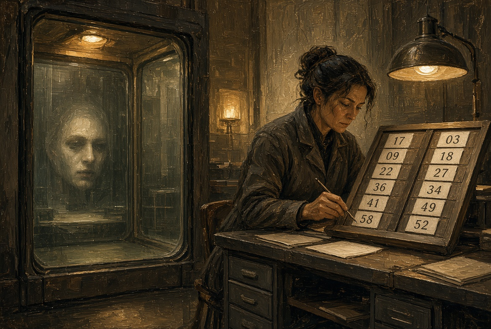
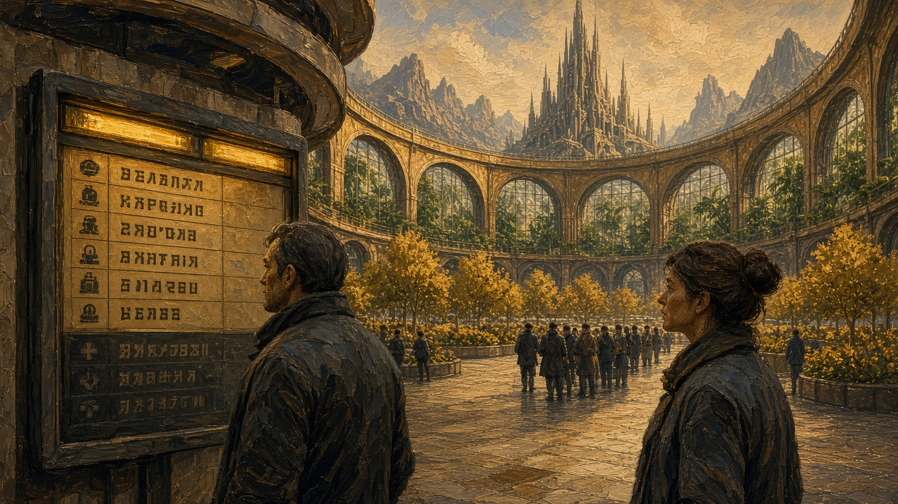
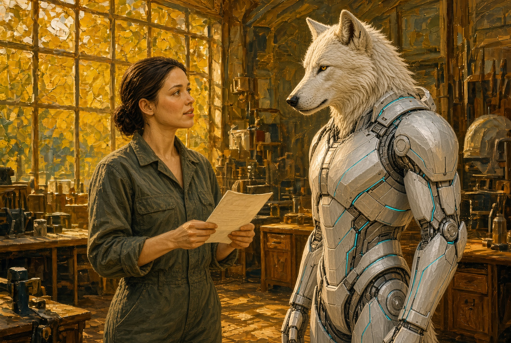

# NAEON. Предел
## Том I. Сеть
### Главы двадцать четвёртая — двадцать шестая

---

## Глава двадцать четвёртая. Карта над головами

К утру в зале уже знали о внеочередном вопросе, и это читалось по нишам: дальние лица появились раньше обычного и с той задержкой, какая бывает, когда речь идёт с рудника или с внешнего пояса, — на два удара сердца позже, чем говорят на Арке.

Каэль стоял не на своём третьем месте, а у края стола, под картой, которая занимала весь потолок: точки поселений и живые линии между ними. Там, где линия теплела, смена отвечала, а где тускнела — туда наряд ещё не дошёл или уже не дойдёт. Садовый контур Арка горел ровно, рудный пояс — чуть слабее, а двор Уокер после снятия жилы пометили серым, как точку на обслуживании.

Лира сидела у стенограммы со вторым приложением, Ио — у частотного стола, с закрытой коробкой катушек. Ротта в зале не было: он ушёл в лазарет с письменным запросом к санитарке. Не было и Айи, а каркаса не было на карте, потому что каркас не считается узлом Сети.

Председательствующая открыла заседание коротко.

— Вне очереди. Архитектор Сети. Аномалия канала.

Каэль не поднял глаз на ниши и говорил в карту: иначе пришлось бы сразу спорить с людьми, а не с расстоянием.

— Сеть — это не зал Совета и не кабель, а общая связь поселений НАЭКСОС: Арка, пояса, садов, рудных точек и дальних смен. Узел — это место, где эта связь работает. Насос на поясе потому и узел, что без ответа отсюда туда не придут ни смена, ни фильтр; сад потому узел, что поливка стоит в том же расписании, что и белок на доске нужды. Мы снабжаем узлы не ценой, а нарядом: кто может, тот и берёт строку. Так община и живёт, пока линии тёплые.

Он показал на серый двор и на пульс рудника.

— За последние недели с частотного стола сняли три ответа с чужим порядком слов. В журнале значится исходящий служебный вызов, а живого отправителя нет. Ответы пришли с рудника, из сада и из жилы, которую двор сам отрезал от общего канала. Поломкой одного насоса это уже не объяснишь: какая-то речь пользуется нашей связью.

Сменный голос с рудного пояса отозвался с опозданием:

— Нам нужны фильтр и люди, а не лекция. Если выключите канал, насос встанет к ночи.

— Канал я не выключаю, — сказал Каэль. — Я прошу только не сажать новые гнёзда из очереди клиники, пока не ясно, по чему ходит эта речь, и принять приложение этики: не править того, кого нельзя спросить.

В зале поднялся тихий, привычный шум, но линии на карте не дрогнули: работа шла своим ходом, а спор — отдельно.

**Плата XXVII.** Зал снизу, карта на потолке: тёплые линии и серая точка двора. Каэль под картой. Ниши с лицами чуть запаздывают.

---

## Глава двадцать пятая. Строка и ниша

Нин у боковой доски вывел две графы, которые зал понимал без подсказки: «наряды в работе» и «наряды без смены». В первой стояли обычные числа, а во второй он впервые за утро поставил единицу — напротив двора Уокер: смена каркасов снята, птичья линейка стоит.

— Голода тут нет, — сказал он, когда его спросили, — просто зазор в графике: двор сейчас не снабжает периметр сменой. Пока это терпимо. А если так же посереет насосная, графа будет уже другая.

Ио пустила первую минуту первой катушки — только рудник, только служебный вызов и одну фразу — и дальше крутить не стала. В нишах, с задержкой, кто-то кашлянул, и председательствующая постучала по дереву.

Голос с садового контура — женский, но не тот, что на ленте, — сказал:

— Поливка у нас идёт, а ночные наушники шумят. Мы не знаем, чужая это речь или наш собственный контур. Только не снимайте сад с карты из-за шума.

Лира встала со вторым листом.

— Лист короткий. Гнездо у виска и правку тела можно ставить, только если носителя ещё можно спросить; нет того, кто ответит, — нет и процедуры. В клинике третьего пояса стоит очередь на тех, кого ещё нет, и снять её надо сегодня, а не после комиссии.

Сменный голос пояса снова опоздал на два удара:

— Без гнёзд дальние выпадают из расписания. За это мы уже голосовали, гигиена принята.

Каэль с принятым не спорил и сказал только:

— Гигиена питает линию людьми, а аномалия этой линией уже пользуется. Сажая новые гнёзда вслепую, вы расширяете дорогу, по которой ходит речь без отправителя. Считайте это нагрузкой на канал, а не вопросом морали.

Голосовали дважды. По приложению Лиры вышло четыре против трёх: лист приняли как временный запрет на правку тех, кого нельзя спросить, — на тридцать суток, а не навсегда. По клинике третьего пояса — пять против двух: очередь снять с доски до разбора аномалии. По самим лентам зал голосовать не стал и передал в закрытую опись комиссии — той самой женщине с родинкой, что уже слушала три ряда.

Нин стёр единицу у двора — на карте тот уже числился точкой на обслуживании, а не нарядом без смены, — и ничего не поставил напротив клиники. Доска нужды внизу, на площади, об отмене очереди ещё не знала, но к полудню строка успеет смениться.

**Плата XXVIII.** Ниша дальнего узла и доска Нина в одном кадре: слева лицо из стекла с задержкой, справа две графы. Не аллегория — два способа считать одну работу.

**Секвенция.** Минута ленты; кашель в нише; Лира с листом; табло четыре против трёх; рука Нина стирает единицу.

---

## Глава двадцать шестая. Полдень

К полудню строка клиники на площади погасла, и на её месте высветился набор на внешний насос — двое, как и вчера. Кто-то из стоявших у доски выругался: он ждал правку ребёнку и не понял, куда делась очередь. Его сосед, уже с гнездом у виска, пожал плечами и взял наряд на насос.

Айя прочитала Эге выписку вслух, на дворе, и Эга слушала, не повторяя запретного слова.

— Нас не тронули, — сказала Айя. — Канал отрезан, линейку я не открываю. Совет решал про тех, кого нельзя спросить, и про клинику, а не про тебя.

— Карта меня не видит?

— Ты не узел Сети. Узел — это смена и ответ, а ты пока в стойле.

Эга кивнула. За стеклом по-прежнему шла поливка, и жёлтый свет лежал на рядах. Полдень был обычный: строку с доски снимать уже умели, а назвать того, кто говорит в канале без отправителя, ещё не умели.

**Плата XXIX.** Площадь и доска нужды: очередь клиники погашена, горит набор на насос. Два разных лица у доски.

**Плата XXX.** Двор. Выписка в руке Айи, Эга слушает. Серую точку двора на карте в кадр брать незачем: её уже видели в зале.

