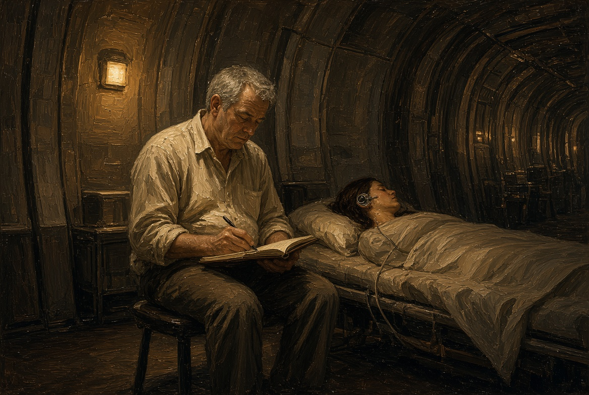
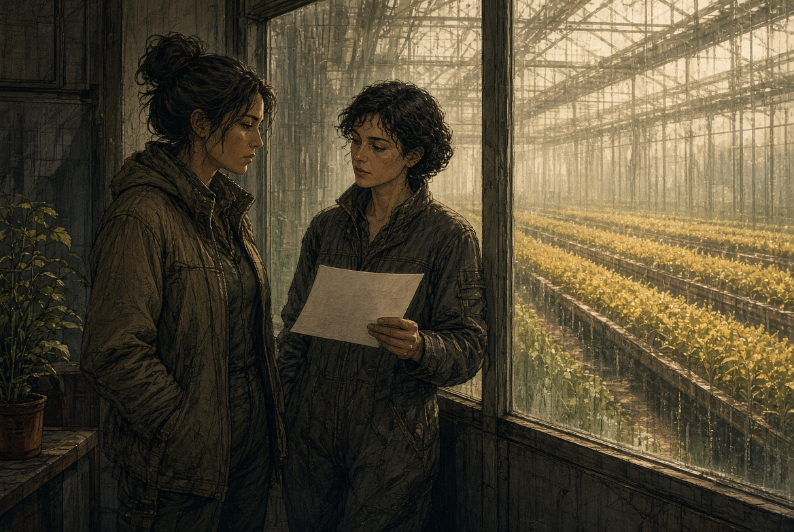
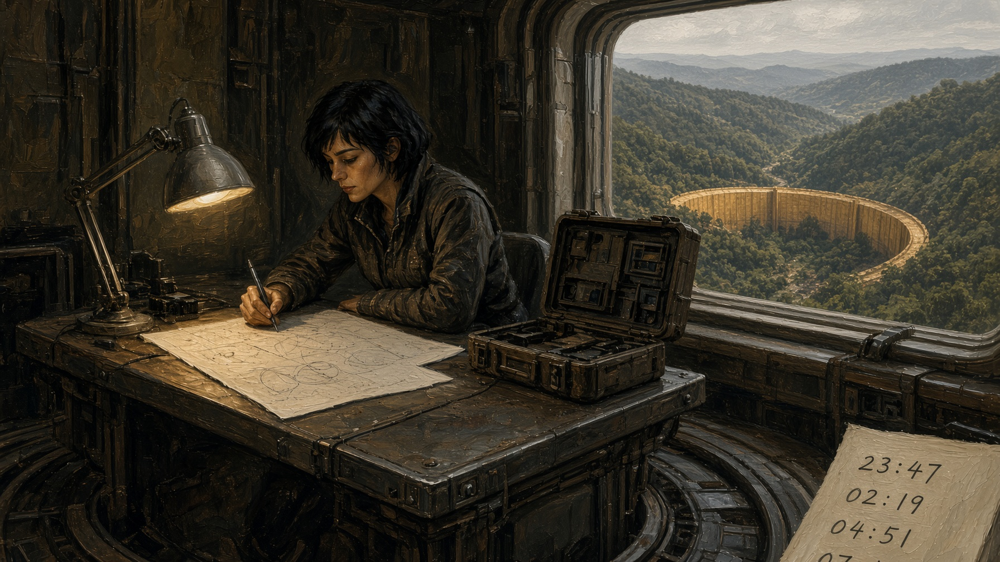
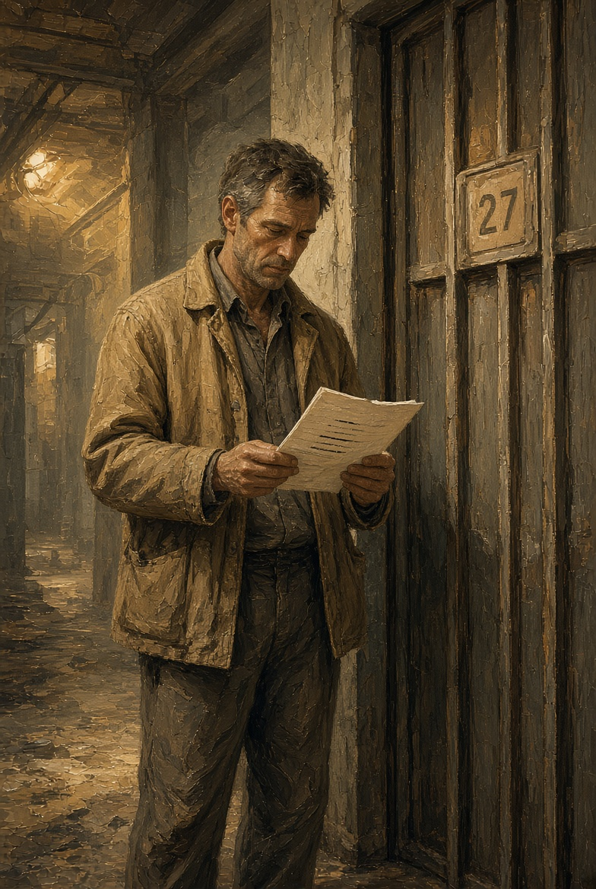

# NAEON. Предел
## Том I. Сеть
### Главы двадцать седьмая — двадцать девятая

---

## Глава двадцать седьмая. Наушник

К вечеру в лазарете, как всегда, пахло кашей и спиртом. Ротт пришёл без халата, с двумя листками — запросом и копией для описи комиссии. Санитарка сидела у двери бывшего холодильника на табурете, который не скрипел только потому, что под одну его ножку давно подложили картон.

Про катушки он говорить не стал и шахтёра больным не назвал, а положил листы ей на колени так, чтобы она могла прочесть сама.

— Ночью вы слышали фразу. Я прошу вашего согласия послушать, что приходит к вам в наушник гнезда. Пластину снимать не буду и память править не буду — только слушать, и только если вы скажете «да».

Санитарка потрогала узкую пластину у виска, как трогают старую застёжку, которую уже не замечаешь.

— Гнездо мне ставили, чтобы смена не терялась, — сказала она. — Расписание, вызов на этаж, кто кого сменяет у койки. А теперь ещё и чужие сны лезут. Это вы хотите слушать?

— Хочу понять, чужой ли это сон или наш канал, — сказал Ротт. — Скажете «нет» — уйду.

Она долго смотрела на копию, потом взяла с подоконника карандаш и вывела кривое «согласна», без отчества, как пишут люди, которым бумаги надоели. Ротт расписался рядом и убрал свой лист в карман, а её лист оставил ей.

Ночью он сидел в коридоре на том же табурете с картонкой под ножкой, а санитарка спала за дверью. В маленьком приёмнике, который он пристроил к пластине снаружи, не прокалывая кожи, сначала шли обычные лазаретные дела: смена к шести, бак с водой, имя Дора, которое она бормотала ещё днём. А ближе к третьему часу приёмник выдал ровную фразу, без сонной невнятицы и без путаницы во рту:

«Слышим мы. Смену не я.»

Будить её Ротт не стал, только записал время в бумажный блокнот. Гнездо у виска, как он теперь понимал, не было узлом на карте Каэля: узел питает насос и поливку, а гнездо ведёт расписание одного человека. И всё же одно и то же «мы» звучало и там, и здесь.

**Плата XXXI.** Коридор лазарета ночью. Ротт на табурете, маленький приёмник у виска спящей женщины, блокнот на колене.

---

## Глава двадцать восьмая. Те, кого нет

Тесс ждала Лиру в нижней галерее садов, где стекло ещё хранило дневное тепло. За стеклом поливка шла по графику, и жёлтый ряд не сбивался. Лира пришла с выпиской заседания, уже без папки комиссии, — один тонкий лист.

— Очередь клиники сняли, — сказала она. — Тридцать суток нельзя править того, кого нельзя спросить, и эмбрионов это тоже касается. А про тебя лист молчит.

Тесс провела пальцем по кромке стекла, по обычному конденсату.

— Про меня листы часто молчат, пока не станет поздно. Я просила не об очереди, а о том, чтобы Эгу не ставили в одну графу с насосом.

— Её в графу и не ставили: каркас на карте не узел Сети. А двор серый потому, что жилу сняли.

— Про серый двор мне уже рассказали, — сказала Тесс. — И люди у доски ругались из-за детей. Ты это слышала?

Лира кивнула.

— Слышала. Запрет написан для того, чтобы клиника не трогала тех, кого ещё нельзя спросить. Завтра кто-нибудь назовёт это жестокостью, послезавтра — зазором в законе, а сегодня это единственное, что заседание успело принять, так и не назвав того, кто говорит в канале.

Тесс не спорила. Она посмотрела на поливку и тихо сказала, как в тот раз, когда речь шла об отсрочке:

— Если они отложат мои вопросы, я не обижусь. Если отложат её — обижусь. Ты это однажды уже слышала, и повторять каждый день я не стану.

Лира сложила лист. В галерее пахло влажной землёй.

**Плата XXXII.** Нижняя галерея. Две женщины у стекла, жёлтый ряд за ним, один тонкий лист.

---

## Глава двадцать девятая. Задержка

Ио сидела у частотного стола на поясе, а не в зале. За иллюминатором тележка на ферме больше не ползла — стояла на стыке, уже без баллонов. На столе лежали четыре метки времени, которые Ио выписала от руки, чтобы не смотреть в чужой журнал.

Рудник ответил на два удара позже Арка, сад — почти сразу, как и положено ближнему контуру. Двор, даже с отрезанной жилой, совпал с садом до доли секунды, чего у мёртвого провода не бывает, а наушник санитарки, по отметке Ротта, пришёл в том же окне, что и рудник.

Слова «эволюция» Ио писать не стала, а написала для себя на обороте бланка приёмки другое: задержка ведёт себя как расстояние, пока не ставит двор вровень с садом, а гнездо — вровень с рудником. Но двор не сад, гнездо не рудник, и значит, либо карта врёт про длину жилы, либо речь идёт не по той жиле, по которой идут наряды. На поясе такую складку уже начинали звать лагом, когда ответ приходит не в свой срок. Ио слово на бланк не вынесла: лагом меряют опоздание пакета, а здесь часть речи приходила раньше жилы, и слова стояли в чужом порядке.

Каэль зашёл без стука, ещё в пыли после узла, посмотрел на четыре цифры и садиться не стал.

— Если это расстояние, я чиню кабель, — сказал он. — А если не расстояние, то кабель ни при чём, и тогда приложение Лиры нас не спасёт: оно закрывает клинику, а канал не закрывает.

— Сегодня кабель не чини, — сказала Ио. — Мне нужна ещё одна ночь без нового узла на карте. Если задержка повторится на пятой точке, будем знать, что точек уже не три.

Он кивнул и ушёл к насосной, потому что насосная всё равно ждала смену, какой бы ни была речь в наушнике.

**Плата XXXIII.** Частотный стол на поясе. Четыре рукописных времени. Ио не смотрит в иллюминатор. За стеклом стоит пустая ферма.

**Плата XXXIV.** Каэль в пыли у дверного ребра, читает цифры стоя.

