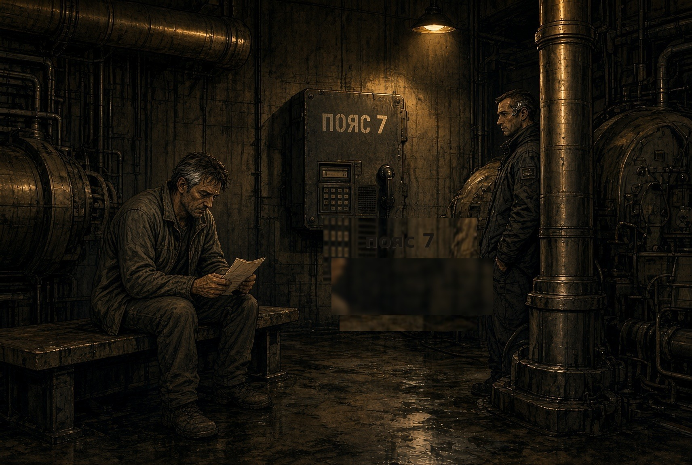
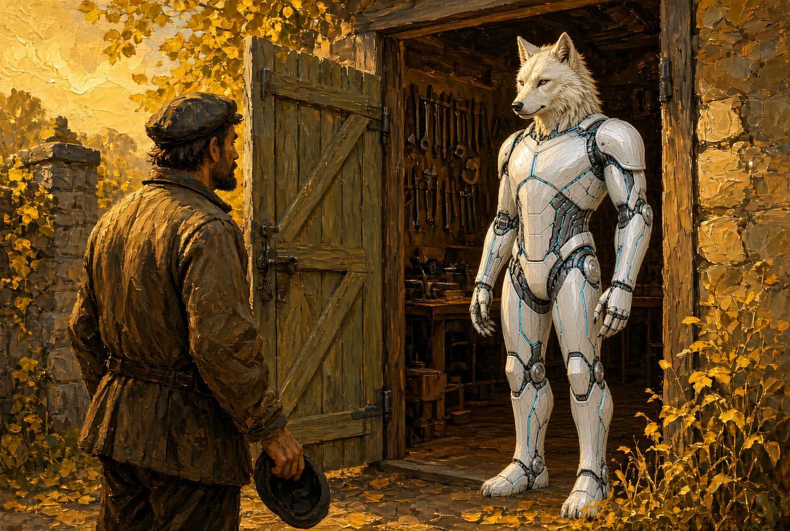
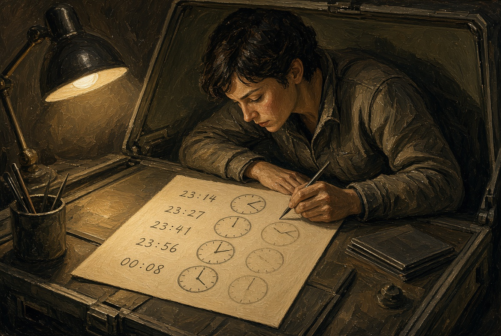

# NAEON. Предел
## Том I. Сеть
### Главы тридцатая — тридцать вторая

---

## Глава тридцатая. Насосная

В насосной третьего пояса пахло мокрой пылью и машинным маслом. Каэль пришёл к смене, как и обещал Ио: новую точку на карту не ставить, а только послушать, как отвечает уже стоящий узел. Узел здесь был простой — насос, фильтр и скамейка, на которой люди ждут, пока выровняется давление. Без ответа с Арка сюда не приходят ни смена, ни запасной фильтр, потому это место и считают рабочей точкой связи.

Дежурный уже сидел у щитка, и гнездо у его виска тускло блестело под лампой. Про заседание он спрашивать не стал, а спросил, будет ли ночью вода на нижний ярус.

— Будет, если фильтр не встанет, — сказал Каэль. — Кабель я не трогаю. Мне нужно послушать, что говорит ваш ящик, когда его никто не вызывает.

Ящик на стене был такой же, как на дворе Уокер, только чище и с номером пояса. Каэль сел на край скамейки, а дежурный пожал плечами и ушёл к трубе: у трубы работа понятнее, чем возле гостя с пояса.

Первый час ящик молчал, как молчит исправная связь, когда её не зовут. Потом, хотя никто не касался кнопки, он сам коротко щёлкнул — тот самый служебный вызов без речи, короткий удар в эфир, как говорит Ио. Каэль не ответил, и через два удара сердца, как с рудника, из ящика прозвучала ровная фраза:

«Слышим мы. Фильтр третьего не бросаем. Смену не я.»

Дежурный у трубы обернулся.

— Это не я, — сказал он. — У меня в наушнике сейчас только график: кто на нижний ярус, кто на бак. А этой фразы в графике нет.

Каэль записал время на обрывке наряда, но новой точки на карту не поставил. Пятая оказалась вовсе не новой — это была старая насосная, которая и так снабжала пояс водой: речь пришла туда же, куда приходит смена.

**Плата XXXV.** Насосная ночью. Скамейка, ящик с номером пояса, Каэль с обрывком бумаги. Дежурный у трубы, не у ящика.

---

## Глава тридцать первая. Линейка

Утром Айя никакого гонца не ждала, но пришёл сам дежурный с пояса — тот, что ночью стоял у трубы. На дворе он снял шапку и сразу заговорил о работе, а не о заседании.

— Насосная слышала ту же фразу. Архитектор говорит, что это уже пятая точка, и велел передать, что карту он не трогал, а птичью линейку просит пока не открывать — не в наказание, а потому, что ящик сам щёлкает.

Айя кивнула: линейку она и так не открывала. На стене по-прежнему висел клочок синей изоленты.

Эга дошла до порога стойла и остановилась: дальше, как условились, ей было нельзя. Она повернула уши к гостю, потом к Айе.

— Это про меня?

— Про ящик на поясе, — сказала Айя. — Ты в стойле, и карта по-прежнему не считает тебя узлом Сети.

Гость посмотрел на каркас так, как смотрят на чужой инструмент, и вопросов не задал: взял с бака кружку, выпил воды, поставил кружку на место и ушёл той же лестницей. После него на дворе пахло маслом с пояса, а не садом.

Айя закрыла ворота. Постановлений она Эге читать не стала — незачем повторять бумаги, которых нет в руках, — и сказала только то, что услышала сама.

— Ночью чужая речь была не у нас, а у насоса. А мы сидим тихо.

Эга без спора вернулась в стойло, даже не поправив щиток на плече. За стеклом кровли поливка уже шла по графику, жёлтым рядом, как и вчера.

**Плата XXXVI.** Ворота двора, гость с пояса в шапке в руке, Эга на пороге стойла, не дальше.

---

## Глава тридцать вторая. Пятая отметка

Ио дописала пятое время на том же бланке приёмки, оборот которого давно уже не был чистым. Насосная третьего пояса совпала с рудником — два удара после Арка; наушник санитарки стоял всё в том же окне, а двор, отрезанный руками, всё так же совпадал с садом.

Каэля она не звала: он и так сидел в насосной и цифру принёс сам. Новой точки на карте не появилось — появилась только уверенность, которой Ио не любила: речь идёт не по длине жилы. Жилы разной длины дают разную задержку, а здесь разные места отвечали так, будто часть из них звучит из одной точки.

Бланк она убрала под крышку стола. За иллюминатором по ферме снова ползла тележка, уже с другими баллонами: работа пояса из-за пяти цифр не остановилась.

**Плата XXXVII.** Частотный стол. Пять рукописных времён на одном обороте. Крышка стола ещё открыта.

