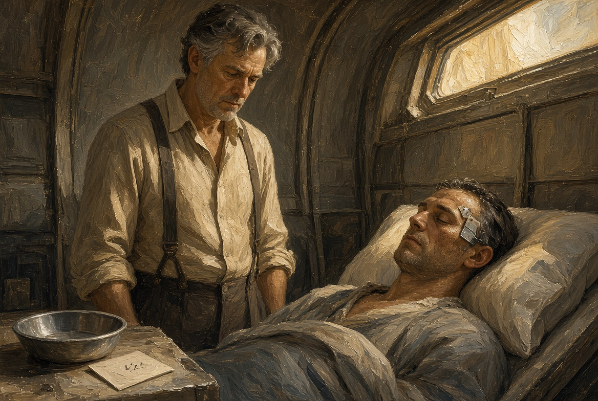
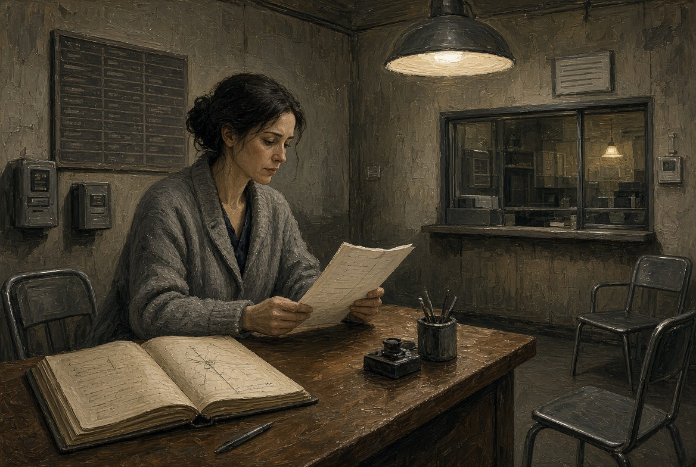
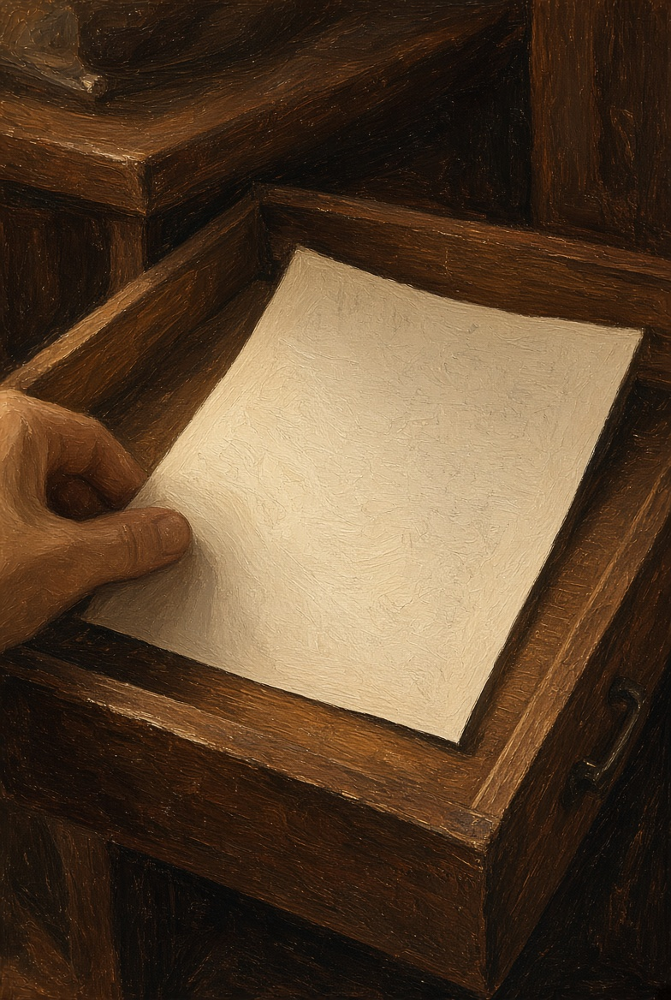
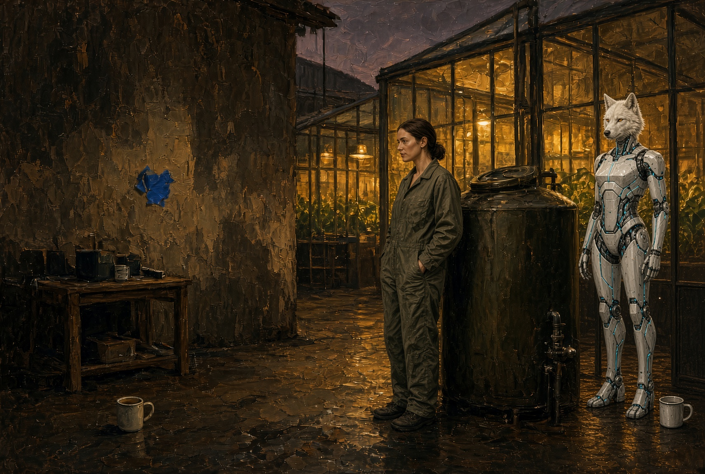

# NAEON. Предел
## Том I. Сеть
### Главы тридцать третья — тридцать пятая

---

## Глава тридцать третья. График и чужое

Утром санитарка сидела на том же табурете, уже в халате и с миской. Ротт пришёл на этот раз не ночью и без приёмника: положил перед ней только листок со временем, которое записал у её виска, и спросил, помнит ли она сон.

— Сон помню кусками, — сказала она. — Бак, смена к шести, а потом чужой голос говорит про фильтр, которого у нас в лазарете нет: про него я только от шахтёра и слышала. Я фильтры не меняю, я кашу разношу.

— Фильтр — это пояс, — сказал Ротт. — Насосная слышала то же самое. Я не прошу вас сравнивать с чужими записями, я прошу сказать: эта фраза есть в графике гнезда или её туда подсадили?

Она потрогала пластину у виска.

— В графике у меня имена коек и кто кого сменяет, а про фильтр третьего там пусто. Значит, ночью в наушник пришло не расписание, а речь снаружи. Снимать гнездо я не дам: без него я путаю этажи. Слушать ещё раз — давайте, а писать за меня чужое — нет.

Ротт не спорил и отметил на своём листе: носитель согласен на прослушивание и не согласен, чтобы ему правили память под эту фразу. Это была не стенограмма Совета — стенограмм он в операционную не носил.

В бывшем холодильнике Дор Нак ел кашу и помнил жену на нижнем ярусе. Ротт заглянул к нему на минуту, но ворошить ночной разговор не стал. Днём шахтёр был самим собой, а ночью фраза звучала не его голосом — в чужом наушнике, в ящике насосной, в жиле, которую двор уже отрезал.

**Плата XXXVIII.** Утро лазарета. Миска, листок со временем, пластина у виска. Ротт не в халате.

---

## Глава тридцать четвёртая. Бумага на пояс

Лира не стала ждать, пока выписку Совета довезут канцелярией: сама сняла копию запрета — тридцать суток не править того, кого нельзя спросить, — и поехала на третий пояс, в клинику, где очередь на доске площади уже погасили, а в журнале врача строка ещё стояла карандашом.

В приёмной клиники пахло спиртом сильнее, чем в лазарете, и совсем не пахло кашей. Дежурный врач смотрел на лист, как смотрят на чужую смену: спорил он не с текстом, а с тем, кто будет отвечать, если ребёнок на нижней койке не дождётся правки.

— Заседание сняло очередь с площади, — сказала Лира, — а в вашем журнале она всё ещё стоит. Снимите её сегодня. Тех, кого ещё нет на свете, не трогать, а тех, кто может ответить сам, не записывать в одну графу с эмбрионом.

— А если без правки шахтёр снова забудет насос и своё имя? — спросил врач. — Нам Ротт таких приводит.

— Тогда пишете запрос и ждёте, пока носитель скажет «да», — сказала Лира. — Это на тридцать суток, не навсегда. Я не связываю вам руки, я только убираю из журнала тех, кого ещё нельзя спросить.

Врач стёр карандашную строку. Бумагу Лиры он убрал в ящик стола, а не повесил на стену: на стену здесь вешали наряды, а не этику. Смотреть, как это будут объяснять родственникам, Лира не осталась — ей было довольно того, что строка исчезла из журнала, по которому людей берут в кресло.

По дороге назад привычно стучали стыки пояса. Запрет теперь был уже не словами заседания, а бумагой в ящике стола.

**Плата XXXIX.** Приёмная клиники. Журнал открыт, карандашная строка ещё видна. Лира с тонким листом. Спирт, не сад.

**Плата XL.** Та же страница после: строка стёрта, лист в ящике стола.

---

## Глава тридцать пятая. Жёлтый ряд

Вечером Айя сидела на дворе у бака, а Эга пила из кружки, не выходя за порог стойла. За стеклом кровли в садах зажглась вечерняя полоса — жёлтый свет, ровные ряды, и никаких новых вестей с пояса.

— Пятая точка была? — спросила Эга.

Айя посмотрела на неё внимательнее, чем утром. Слова «пятая точка» каркас мог взять только с порога, из утреннего разговора дежурного на дворе. Этого хватало, а постановления там не было.

— Была насосная, — сказала Айя, — старое место, не новое. Речь пришла туда, куда и так приходит смена, а тебя туда не звали.

— Карта?

— Серая, как и вчера. Линейку я не открою, а слово, от которого отвечал ящик, ты не повторяешь. На сегодня этого довольно.

Эга кивнула и поставила кружку на пол; уши у неё остались повёрнуты к Айе, а не к стене, где когда-то висел ящик. На дворе было тихо: стол вытерт, смена разведена, на подоконнике снова лежал чей-то хлеб, не их. Поливка за стеклом не сбивалась, и пока она шла по графику, пяти отметок Ио с площади ещё не было видно.

**Плата XLI.** Вечер двора. Кружка на полу стойла, жёлтый ряд за стеклом, клочок синей ленты на стене. Айя у бака.

