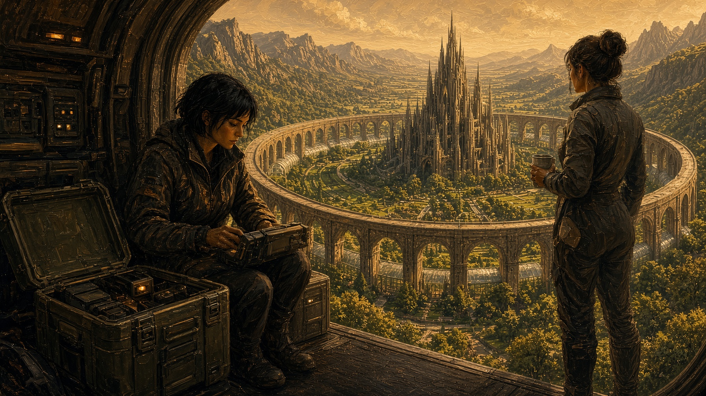
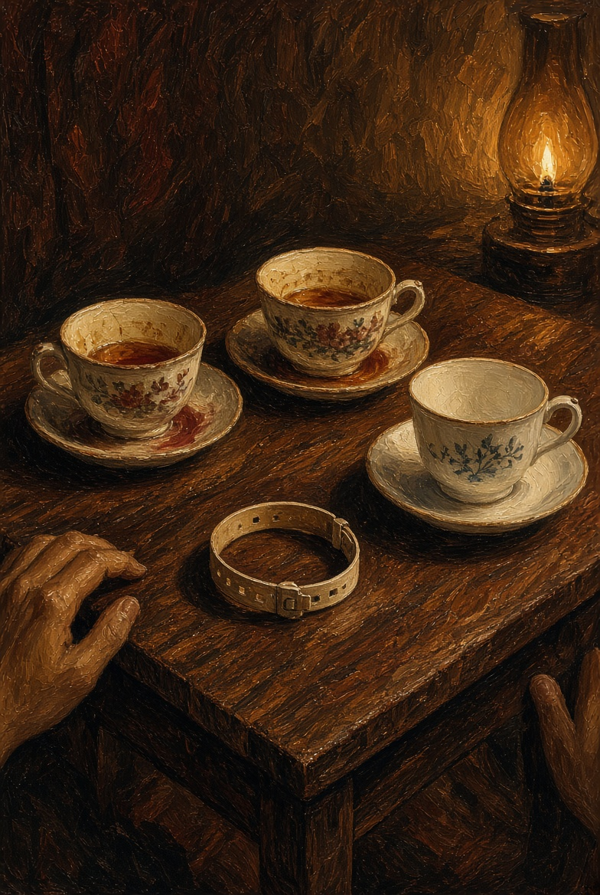
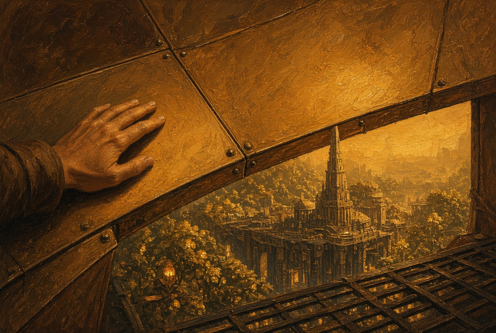
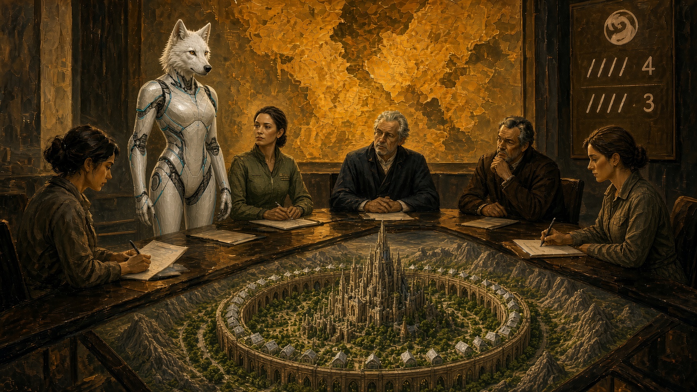
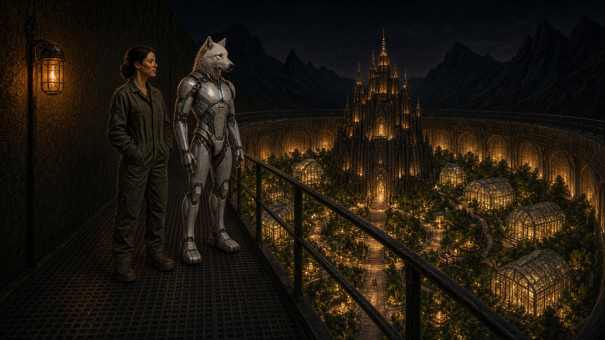
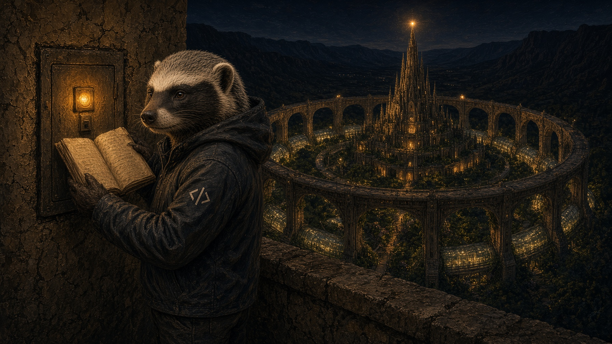

# NAEON. Предел

## Том I. Сеть

### Главы тридцать шестая — сороковая

---

## Глава тридцать шестая. Борт

Ио Саф поехала к воротам пояса сама, не вызывая смены и ни о чём не прося зал. Пять отметок на обороте бланка приёмки уже говорили, что речь идёт не по длине жилы, и Ио хотела послушать место, у которого жилы нет вовсе, — борт в рейсе. Ждать, пока шестой случай сам придёт в зал, она не хотела: зал назовёт его усталостью линии и уснёт.

На причале пахло резиной отбойника и горячим маслом. Челнок с рудника стоял на захватах с открытым люком, а экипаж пил воду из бака у рельса. Пилот, женщина с пылью в складке шеи, кивнула Ио как человеку, которого здесь не ждут, но всё равно пускают: у частотного стола есть допуск на борт.

— Мне нужна лента с рейса, — сказала Ио, — только служебная. Разговоры экипажа мне ни к чему.

— Бери, — сказала пилот. — Там, кроме служебной, ничего и нет: в полёте мы молчим. Над садами говорить не любят, эхо уходит в жилые ярусы.

Ио села у бортового ящика. Лента шла ровно: выход, набор высоты, рукопожатие с рудным узлом, короткий наряд на фильтр, который давно закрыли. А на двенадцатой минуте, над склоном, где Медоед по ночам чинит кромку, в служебный канал без речи вписался человеческий ответ.

«Слышим мы. Смену не я. Пояс не бросаем.»

Тембр был тот же, что на первой катушке, — не пилота и не шахтёра, а общий.

Ио прокрутила назад: вызов с борта не уходил, и ответ пришёл на пустое место, хотя прежде речь всегда цеплялась за вызов, записанный в журнале. Она сняла копию, подписала время и рейс и только потом спросила пилота:

— На двенадцатой минуте у вас кто говорил?

Пилот пожала плечами.

— Никто. Я же сказала, мы молчим.

Ио кивнула и спорить не стала. На обратном пути через галерею она смотрела вниз, внутрь Арка: сады, шпиль Цитадели и окна жилья под стеклянными кровлями. Катушку она понесла в архив, а не в зал.

Лира без лишних слов открыла сейф, положила четвёртую катушку к трём прежним, приписала на дверце под «три» — «четыре» и снова повесила ключ на шею. Ио положила рядом бланк приёмки и дописала на обороте шестое время.

— У борта жилы нет вовсе, — сказала Ио. — Значит, кабель тут ни при чём.

— Значит, шесть мест, — сказала Лира, пробежав глазами бланк. — Рудник, сад, двор, наушник санитарки, насосная и борт. Комиссия всё равно спросит, не ошиблась ли ты шесть раз подряд. Опись я допишу и отдам председателю комиссии, но в зал с новым вопросом не пойду, пока не пойму, о чём просить: мой запрет закрывает клинику, а канал не закрывает. Только не носи это Каэлю раньше описи, а то он начнёт лечить картой.

Ио согласилась. Под кожей у виска её собственное гнездо отозвалось теплом, как после долгой смены, но Лире она об этом не сказала: своё гнездо она пока ещё считала инструментом, а не входом.

**Плата.** Открытый люк челнока на земных воротах. Ио у ящика. Внизу — сад, не звёзды.

---

## Глава тридцать седьмая. Третья чашка

Дома у Ординых снова стояли три чашки, но Лира не пришла. Тесс налила чаю Ротту и себе, а пустую чашку поставила так, как оставляют место, которое ещё могут занять.

Ротт снял браслет допуска и положил на стол. Руки у него после смены пахли спиртом: он мыл их в клинике дольше, чем требует устав, и всё равно приносил запах домой.

— Санитарка согласилась, чтобы её слушали, а править память не согласилась, — сказал он. — Шахтёр днём помнит жену и насос, а ночью фраза приходит не из него. Ио, похоже, мало трёх катушек: она ходит по поясу с ящиком.

— Знаю, — сказала Тесс. — Лира мне про катушки не говорит, она говорит про поля. Этого довольно.

Она не сидела, поджав ноги, как тогда, после зала, а держалась прямо. Медицинский лист лежал под блюдцем лицом вниз.

— Частичную перепись я тебе делать не дам, — сказала она. — Не в этом году и не под гигиену. И не потому, что не люблю твои руки, а потому, что после шахтёра я слышала слово «мы» слишком близко к своей постели.

Ротт долго смотрел на неё и сразу спорить не стал, а для него это было уже немало.

— Без правки тракт ослабнет, — тихо сказал он. — Ты сама это читала.

— Пусть ослабнет позже. Сейчас я ещё говорю «я», а если ты впишешь меня в очередь как узел, я перестану отличать заботу от захвата.

Он кивнул — не в знак согласия, а в знак того, что услышал. Папка так и осталась стоять за шкафом, и он к ней не пошёл. Тесс это видела, но легче ей от этого не стало: отсрочка для них обоих уже была знакомым словом.

За переборкой гудел пояс на опорах. В третьей чашке остыл чай.

**Плата.** Узкий стол. Три чашки. Браслет допуска на дереве.

---

## Глава тридцать восьмая. Киль

Нин Наэльн позвал Каэля не в буфет и не в зал, а к панелям киля, туда, где тепловой контур шумит ровнее, чем в кессоне. Наряд на «контур» он ставил уже три недели и все три недели не любил его объяснять.

Панели были закрыты, металл — тёплый. Внизу за решёткой мостка зеленели сады внутри кольца, дальше виднелись площади и шпиль Цитадели, а у ворот готовили челнок к вечернему рейсу.

— В таблице это отопление, — сказал Нин, — а в спецификации не только отопление. Я не архитектор, я вижу расход сплава. На контур сплава уходит столько же, сколько на ворота и двор вместе, а галереи так не греют.

Каэль положил ладонь на панель, но открывать не стал.

— Пояс собран, чтобы жить сейчас, — сказал он, — и чтобы уйти, если земля перестанет быть домом. Постановления на этот счёт нет, это просто запас. Доктрина запаса не запрещает — она запрещает хозяина над запасом.

— Если скажешь это в зале, — сказал Нин, — шесть голосов спросят, куда ты собрался улетать с садами, а один спросит, кого ты оставишь внизу.

Каэль чуть улыбнулся — коротко, как с ним бывало редко.

— Поэтому в зале я и говорю «контур». А ты ставь наряд как отопление, и цифру лишнего сплава оставь карандашом, не в общей графе. Когда придёт срок, графа сама себя найдёт.

Нин кивнул, но сразу не ушёл: ему было неловко за собственную ясность — он снова видел число раньше имени. На кромке, у маяка, мелькнул капюшон, и Каэль кивнул в ту сторону, как тогда, утром после запуска узла. Ремонтник кромки не обязан был слышать про запас.

— Он здесь часто бывает, — сказал Нин.

— Ну и пусть бывает, — сказал Каэль. — Без него кромка остывает.

Они разошлись до вечерней смены. Панели так и остались закрытыми, а внизу поливка шла по графику.

**Плата.** Закрытый киль пояса. Тёплая панель. Город под опорами.

---

## Глава тридцать девятая. Девяносто суток

Окно комиссии почти без зазора в календаре совпало с концом девяноста суток. Зал собрали не вне очереди, а в обычный день: карта теплела, дальние ниши, как всегда, опаздывали на два удара.

На этот раз Айя привела Эгиду. Кресла для каркаса по-прежнему не было, и Айя снова не дала поставить её к приборам. Лира сидела у стенограммы, Каэль смотрел на рудную линию, Ротт пришёл без папки, Тесс села в боковой ряд. Нин вывел две графы и ни одной не вычеркнул заранее. Ио не включала трансляцию на борт: после катушки с борта она боялась, что зал услышит не то, что говорит.

Председательствующая прочитала коротко.

— Комиссия закрытого состава: гражданское имя не присвоено, служебное сохранить, неслужебную метку «Эга» не уничтожать и не выносить в реестр. Приложение Венн по носителям, принятое временно на тридцать суток, снова стоит в очереди. Предложение к голосованию то же, что девяносто суток назад. Кто хочет с места?

Сразу никто не встал. Потом Каэль сказал, не поднимаясь с места:

— Узел работает, пояс работает, каркас на учении у ворот человека не сломал. Я не вижу новой причины отказать ей в имени — но не вижу и большинства. Поэтому прошу не притворяться, будто мы что-то решили: мы снова откладываем.

Ротт сказал ещё короче:

— Будь у меня голос, я голосовал бы не за лицо, а против того, чтобы отсутствие выбора писали как исправность.

Лира слова не просила, а только вывела на поле одну строку: решение снова отсрочено — почерком злее, чем в первый раз.

Голосовали, и свет на табло сложился знакомо: четыре против трёх. Председательствующая прочла без торжества.

— Служебное обозначение сохранить. Гражданского имени нет. Опека двора Уокер. Приложение по носителям — в очередь. Комиссия не закрыта.

Эга посмотрела на табло, потом на Айю.

— Опять позже.

— Опять позже, — сказала Айя. — Пошли на периметр, там хотя бы ветер честный.

**Плата.** Табло зала. Четыре против трёх. Эга в первом ряду, кресла нет.

---

## Глава сороковая. Периметр

К ночи Айя вывела Эгу на внешний край пояса. Ветер здесь был настоящий, лампы не слепили, и внутри кольца гасли окна. С ворот ушёл последний челнок, низко, к руднику, с огнями вдоль корпуса.

Эга стояла прямо, уже привыкнув к собственному весу. Щиток на левом плече сидел ровно, и изнанку Айя не снимала: три буквы там жили с того вечера, когда она вывела их маркером.

— В первую ночь на этом борту я сказала тебе «я», — сказала Эга. — Ты ответила, что слышишь и что это уже не инструкция. Сегодня зал снова сказал «позже», а слово на изнанке оставил при мне и в реестр не внёс. Мне нужно, чтобы ты услышала его так же, как тогда услышала «я», и чтобы это слышала ты, а не комиссия.

Айя сунула руки в карманы куртки. Она помнила ту ночь и свою же фразу, сказанную ещё до того, как имя появилось на металле.

— Говори.

Эга смотрела перед собой, в тёмную полосу над садами, туда же, куда смотрела в первый раз.

— Эга. Меня можно звать так, и это то же «я», только теперь у него есть слово, которое ты написала. Если позже это запретят и меня разберут, я всё равно была, и имя тоже было.

Айя кивнула тем же коротким кивком, каким когда-то приняла тепло из открытой груди. Слова первой ночи она сказала снова и на этот раз оставила их при Эге.

— Слышу. И это уже не инструкция. В первый раз я сказала это, ещё не зная, что придётся держать. Сейчас говорю, потому что держу.

Они постояли ещё немного. Потом Айя сказала «пошли» — и они пошли вдоль борта к тёплому шлюзу двора, а за спиной у них гудел контур в киле, который в нарядах всё ещё называли отоплением.

**Плата.** Край пояса ночью. Айя и псовый каркас. Город внизу.

---

## Эпилог. Журнал на кромке

После последней главы Медоед снова пришёл к служебному узлу на кромке пояса. Галереи шли по верху медовой аркады, внизу внутри кольца гасли окна, и Цитадель держала дежурный шпиль. Панели киля были закрыты, тепловой контур шумел ровно.

Ключ лёг в панель. За ночь журнал накопил обычное — задержку с рудника, повтор наряда, короткий обрыв у садового контура, — и среди этого снова лежала строка без номера узла, того же рода, что он открыл ещё осенью, до слушания о лице.

Медоед открыл её так, как открывал в ту осень: почерк он уже знал. Модель, запертая под тегом «не возобновлять», снова ответила раньше, чем позволяет расстояние, и речи зала в ответе не было. Чужой порядок слов совпал с тем, что Ио снимала с рудника, из сада, с глухой жилы двора и с борта и что шахтёр ночью произносил не своим голосом. Имя модели он не позвал, потому что стёр его давно. Новым в журнале было другое. Строка метила сразу три места: дальнюю точку, челнок и ворота, где каркас не дожал живого человека. Рядом с осенней пометкой, что это ответ из запрещённого слоя, он приписал для себя, не для Совета: отвечает уже не ему одному.

Пояс всё ещё шёл по верху аркады, и порт был открыт. Работа, которую ему выдали как стабильность, снова расходилась с той, которую он когда-то начал сам.

Он вынул ключ и пошёл вдоль кромки, а не в город. Внизу Арк мигал строками нужды. Сеть была ещё цела.

**Плата.** Кромка пояса ночью. Капюшон у панели. Внизу город. В журнале — строка без адреса.

